# VirtualBox/VMware setup, install Server 2016/2022

## VirtualBox/VMware setup

### Installation

1. Navigate to VirtualBox/VMware website and dowload platform package host for neccessary machine (Windows,OS,Linux,Solaris)
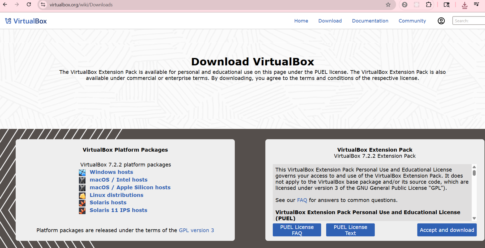

2. Navigate to Microsoft Evalution website and download Windows Server
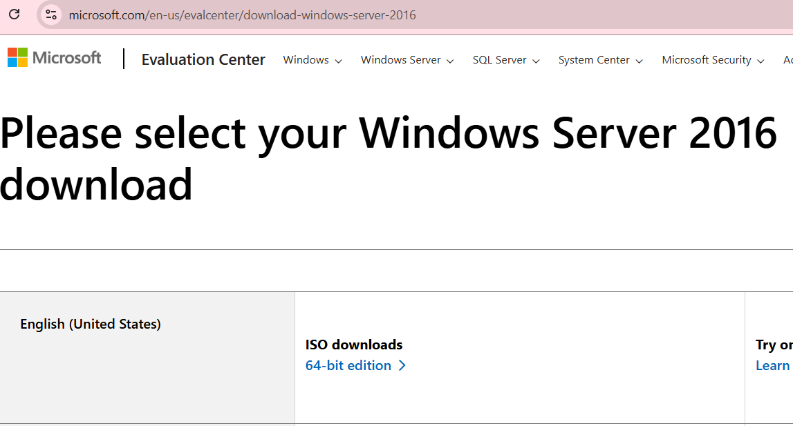

### VirtualBox Setup

1. Open VirtualBox
- Create new Virtual Machine
- Setup VM Operating System, password and specify virtual hardware and diskware
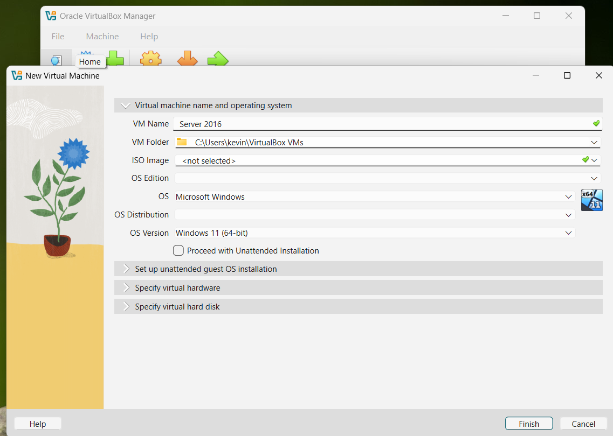

- Power on VM
- Add downloaded Windows Server ISO image To Boot up Windows
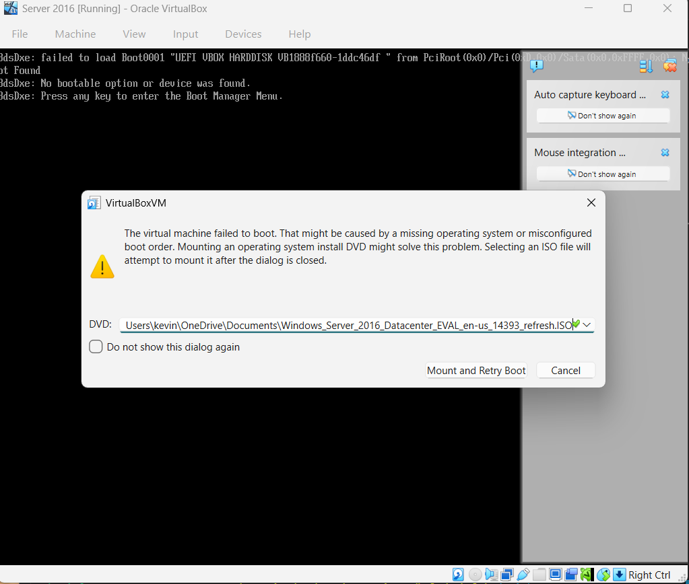

### Desktop Experience Setup

1. In Windows Setup,
- Select with Windows Server Desktop Experience
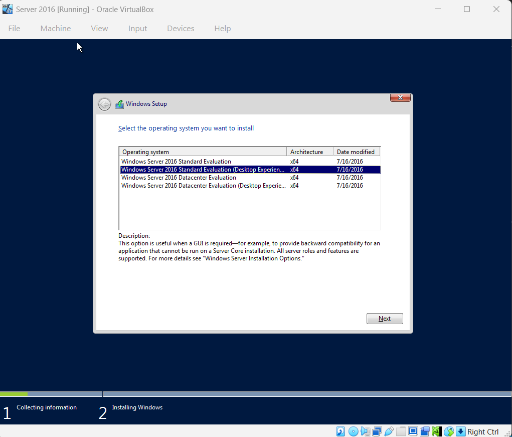

- Select Custom Install Windows only
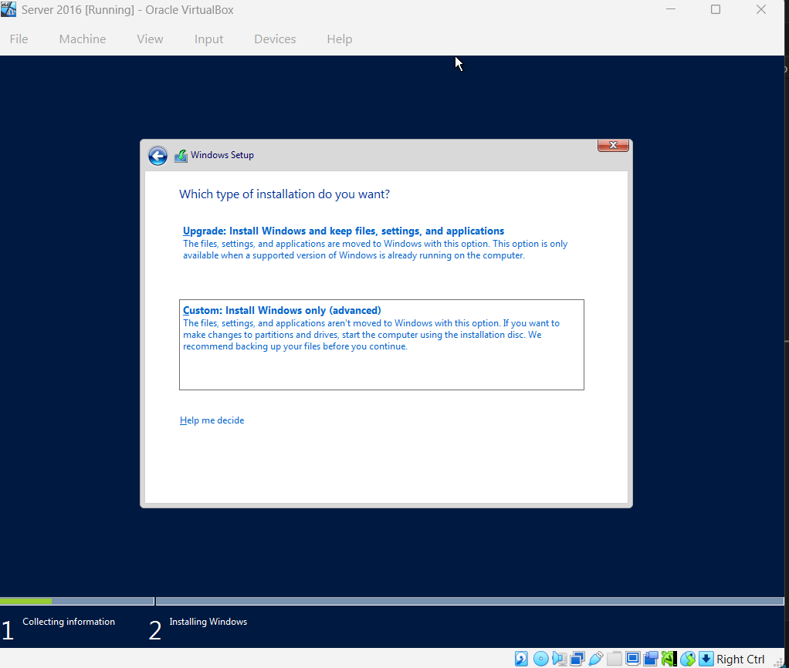 

- Proceed With Default Setup

2. In Customize Settings, Create Administrator username and password
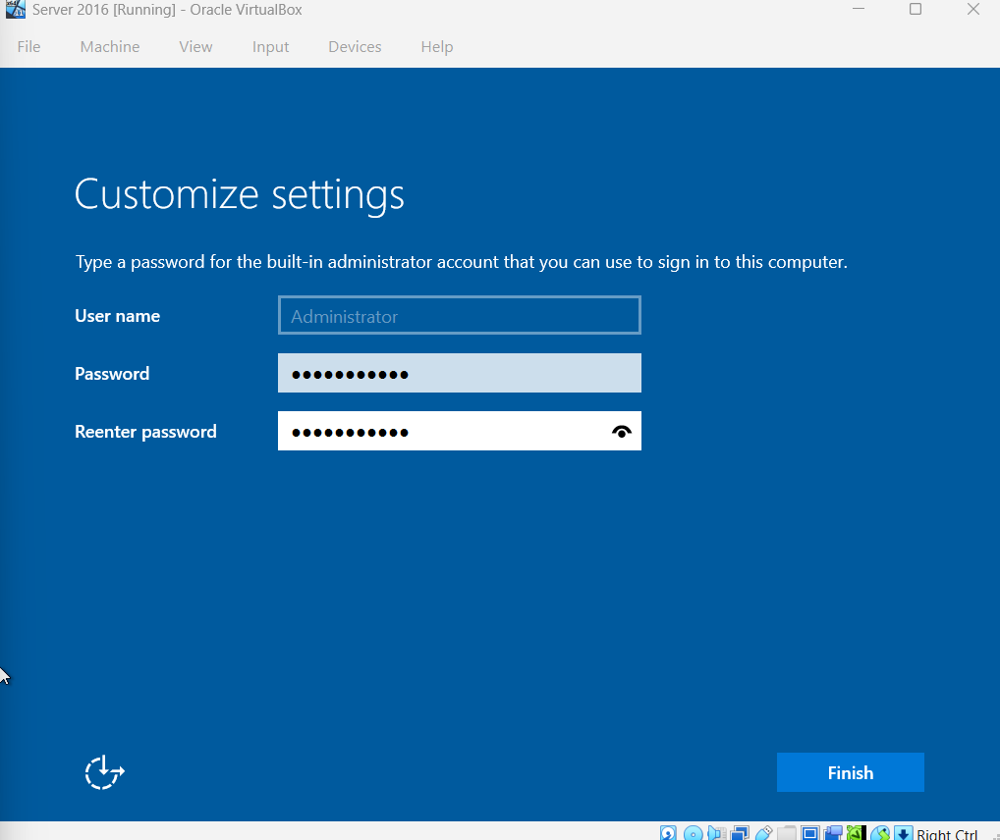

3. Log in to Administrator Account
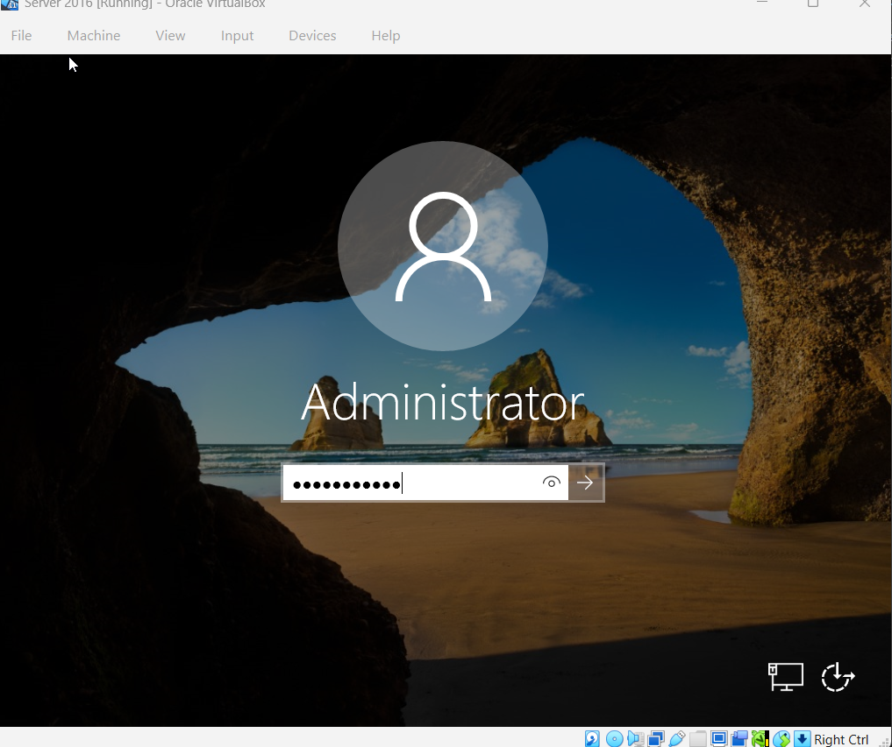

### Create Static IP address (To use Later to join client to this domain)

1. Navigate to Command Prompt(CMD) as Administrator

2. Type "ipconfig" to check current IP address (We want to change IP address to static so it doesn't change, only neccessary for lab environments)
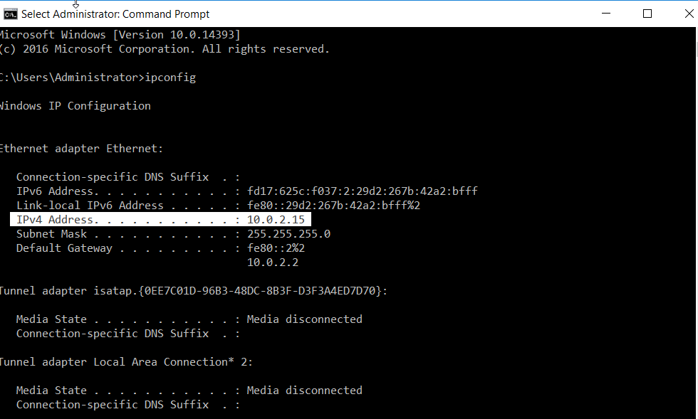

3. Navigate to Control Panel -> select "Network and Internet: View network status and tasks" -> "change adapter settings" -> "Ethernet" -> "Properties" -> select "TCP/IPV4"
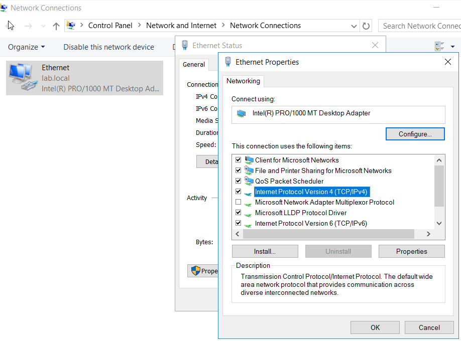

4. In TCP/IPV4 properties,
- select "use the following IP address"
- Fill in the following IP address and DNS server address credentials
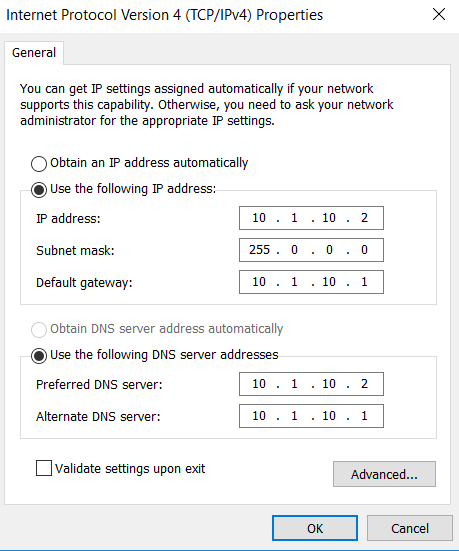
