# VirtualBox/VMware setup, install Server 2016/2022

## VirtualBox/VMware setup

### Installation

1. Navigate to VirtualBox/VMware website and dowload platform package host for neccessary machine (Windows,OS,Linux,Solaris)
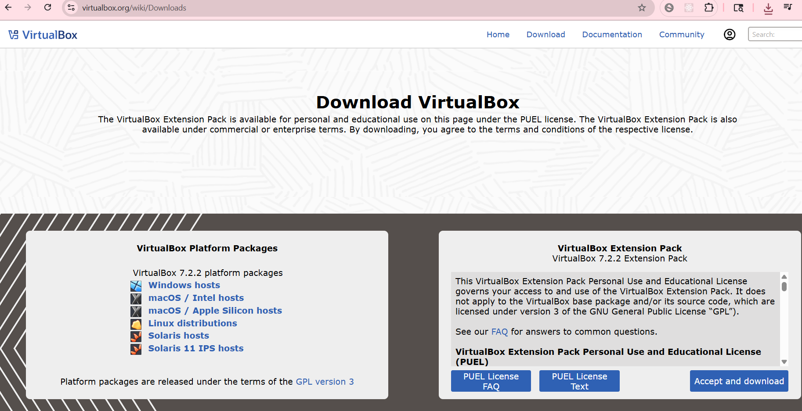

2. Navigate to Microsoft Evalution website and download Windows Server
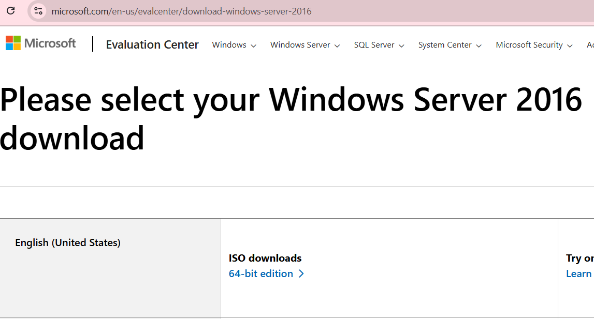

### VirtualBox Windows Server Setup (Administrator)

1. Open VirtualBox
- Create new Virtual Machine
- Setup Virtual machine name and Operating System, Unattended guest OS installation(Username & password), specify virtual hardware and diskware
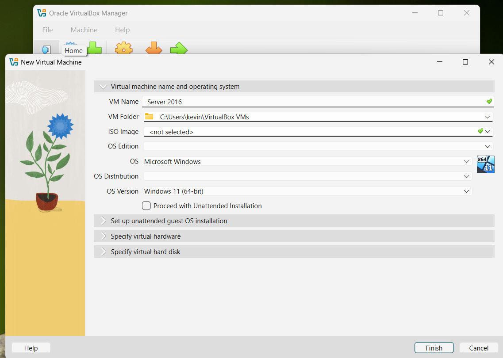
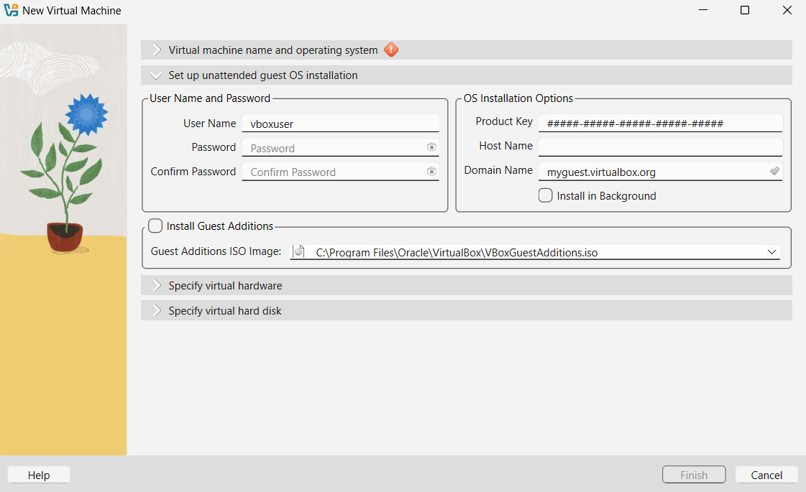
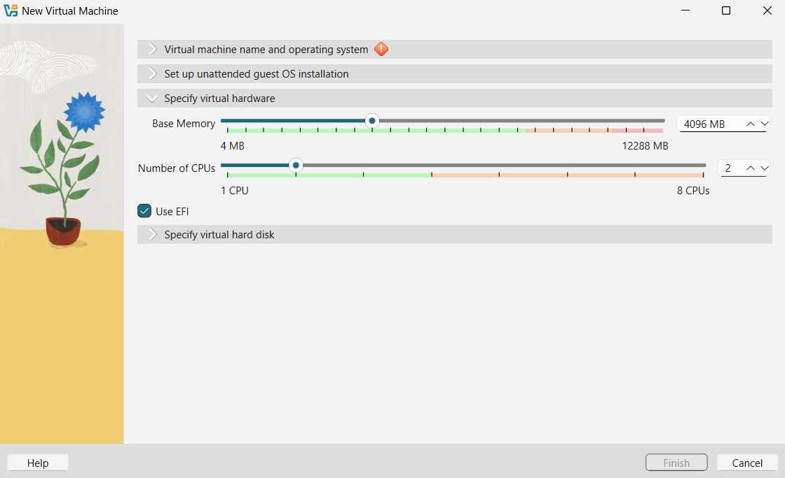
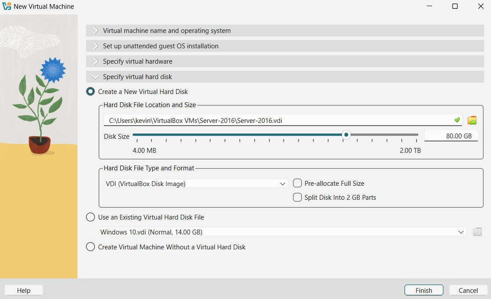

- Power on VM
- Add downloaded Windows Server ISO image To Boot up Windows
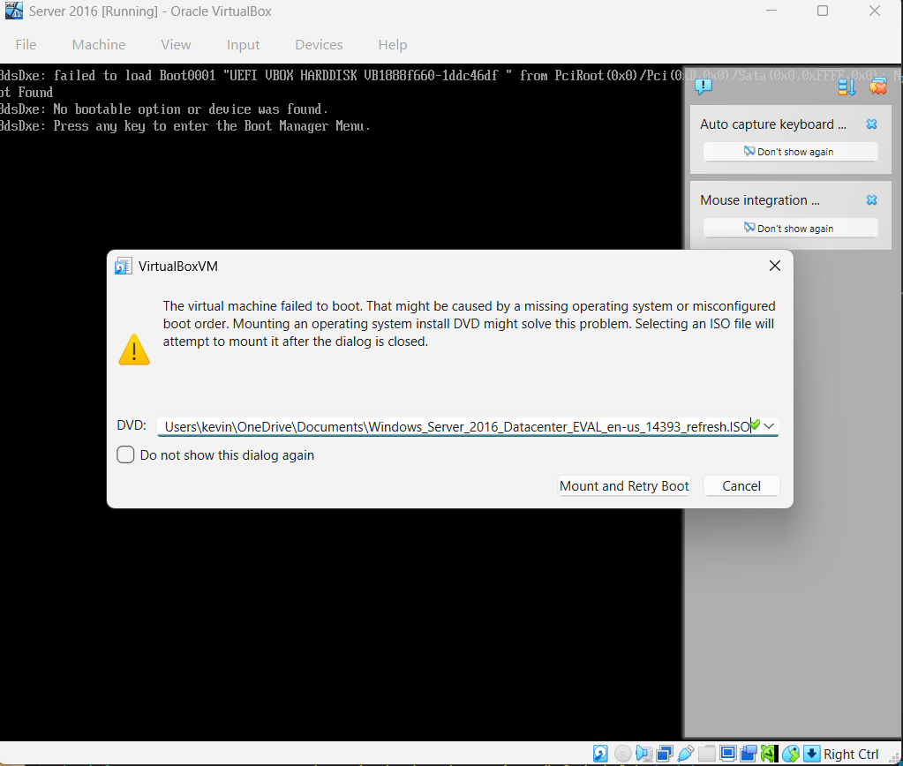

### Desktop Experience Setup

1. In Windows Setup,
- Select Windows Server Desktop Experience
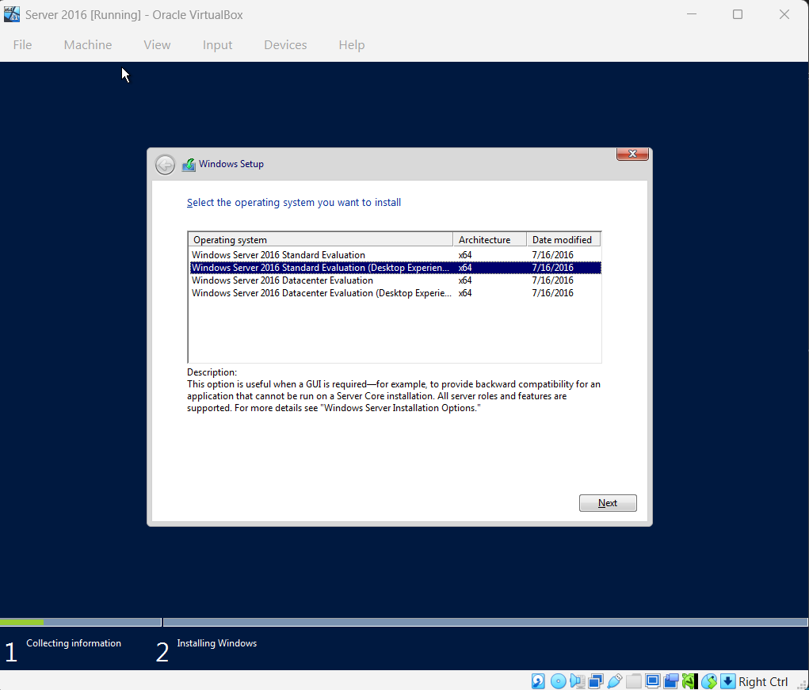

- Select Custom Install Windows only
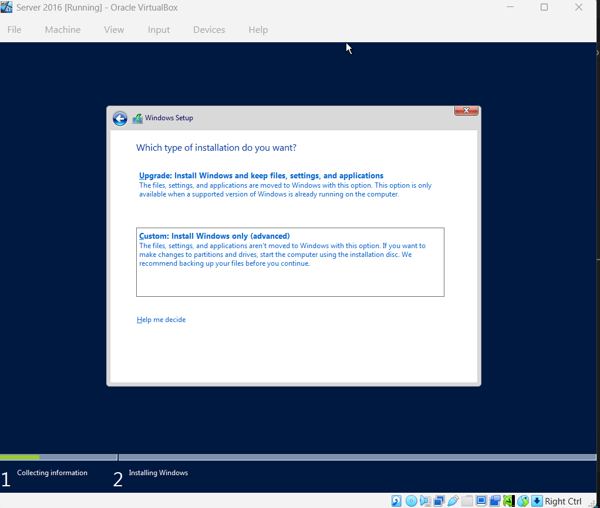 

- Proceed With Default Setup

2. In Customize Settings, Create Administrator username and password
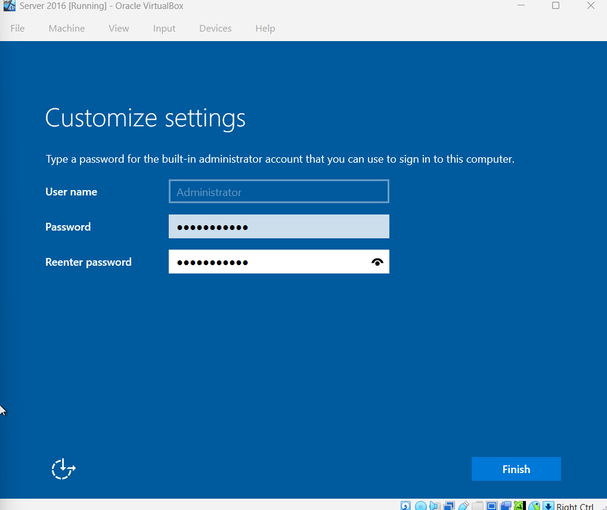

3. Log in to Administrator Account
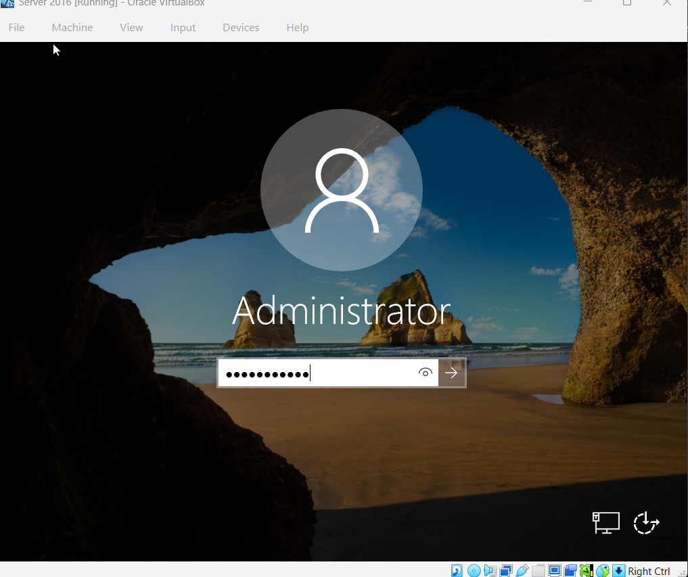

### Create Static IP address (In order to join a client to this domain later on)

1. Navigate to Command Prompt(CMD) as Administrator using the Search tool in the taskbar
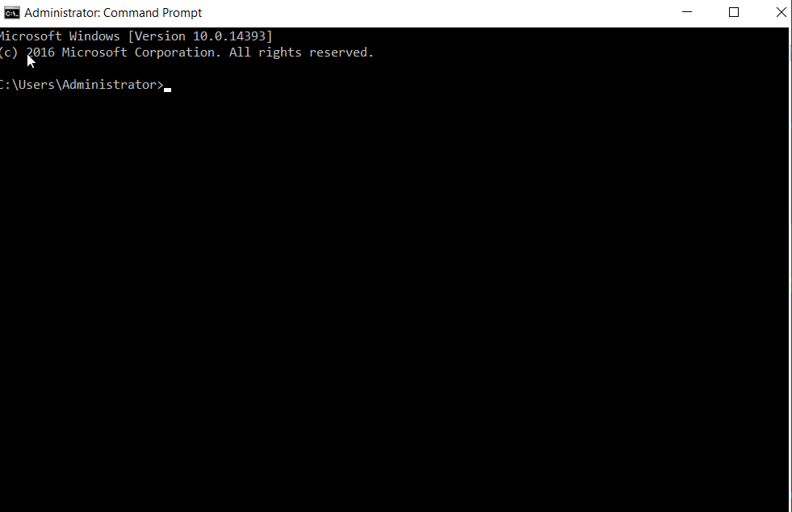

2. Type "ipconfig" to check current IP address (We want to change IP address to "static" so it doesn't change, which is only neccessary for lab environments)
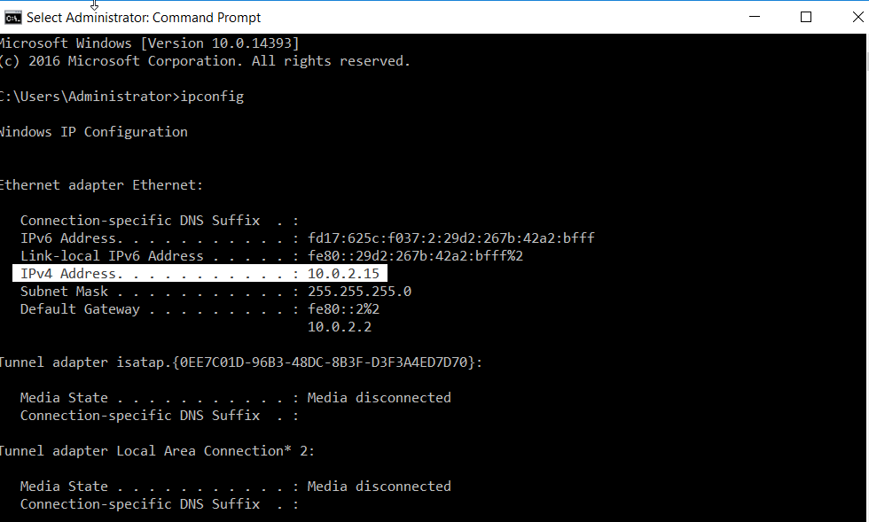

3. Navigate to Control Panel -> select "Network and Internet: View network status and tasks" -> "change adapter settings" -> "Ethernet" -> "Properties" -> select "TCP/IPV4"
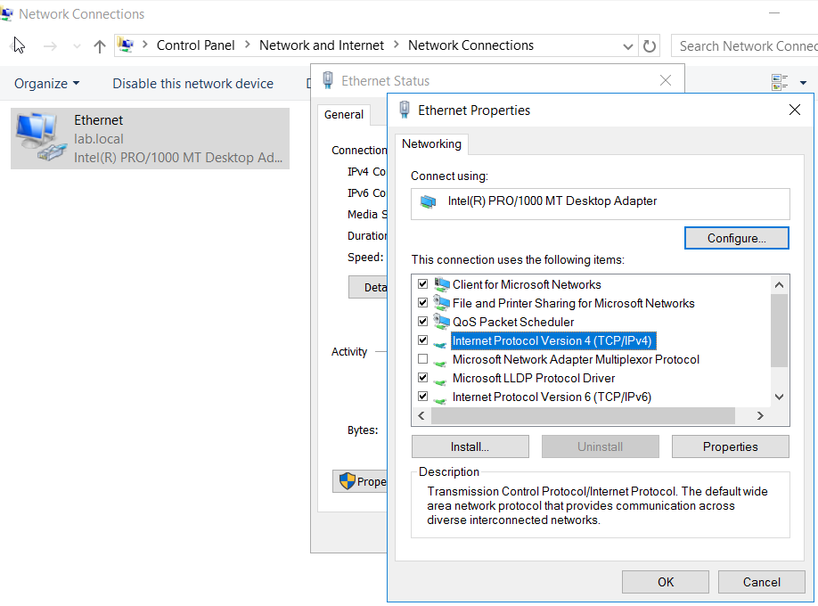

4. In TCP/IPV4 properties,
- select "use the following IP address", fill in the following IP address and DNS server address credentials
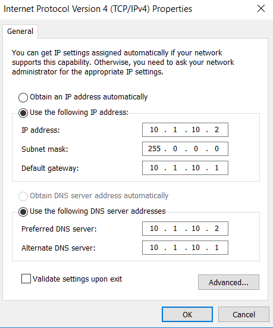
