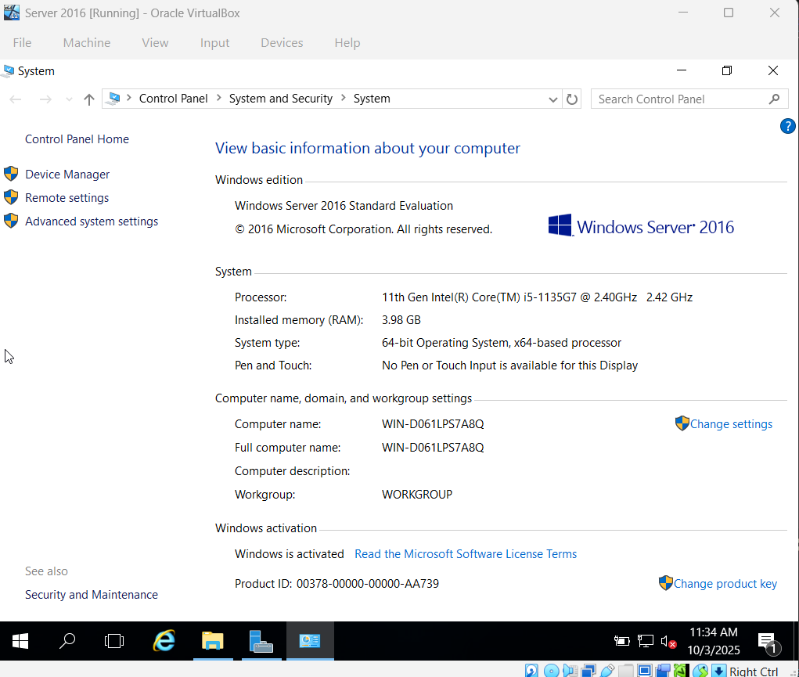

# Renaming Server and Installing Active Directory

## Renaming Server

1. Navigate to File Explorer -> Right-click "This PC" -> Select Properties

2. In "Computer name, domain, and workgroup settings", select change settings -> change

3. Change Computer name and Restart Computer
pic

## Installing Active Directory
