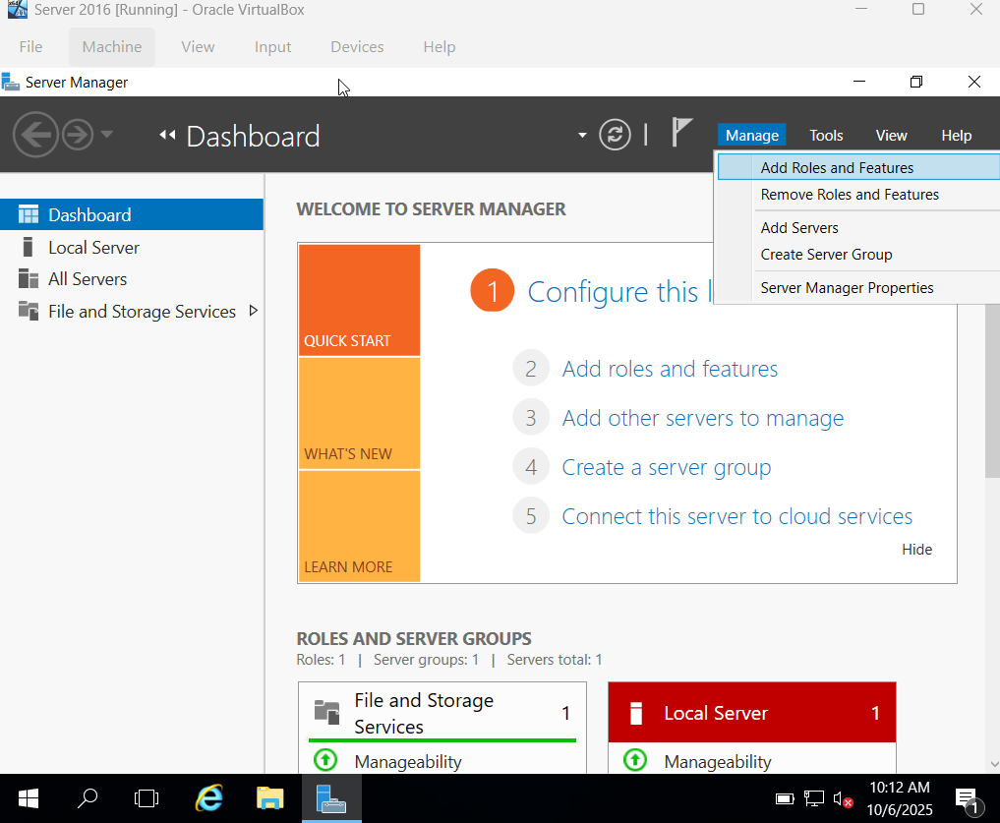
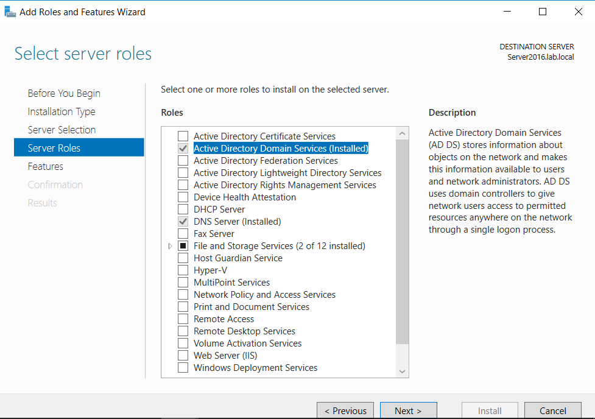
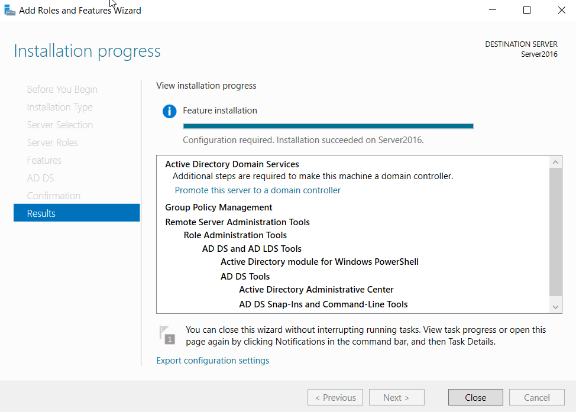
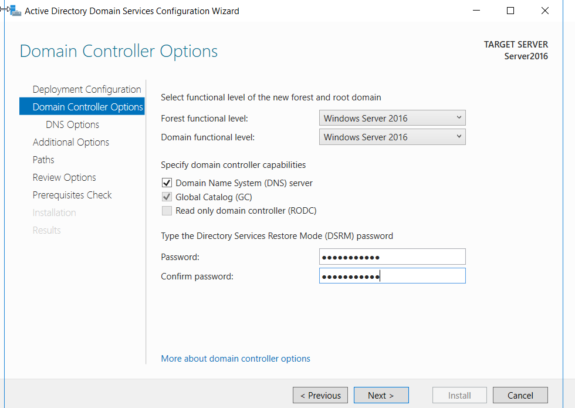

# Renaming Server and Installing Active Directory

## Renaming Server

1. Navigate to File Explorer -> Right-click "This PC" -> Select Properties

2. In "Computer name, domain, and workgroup settings", select change settings -> change

3. Change Computer name and Restart Computer

## Installing Active Directory

1. Navigate to Server Manager and select "Add Roles and Features"

2. In "Add Roles and Features Wizard",
- In Server Selection, select "Active Directory Domain Services"
- Leave Default setup , and select "Install"

3. After installation complete, Select "Promote this server to a domain controller"

4. In "Active Directory Domain Services Configuration Wizard",
- In Deployment Configuration, select "add a new forest" and create a root domain name (ending in .local/.com/.org)
- In Domain Controller Options, create a DSRM password
- Leave Default setup , and select "Install" 

