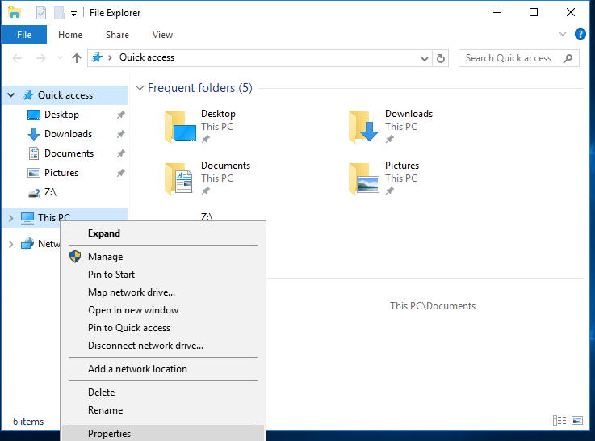
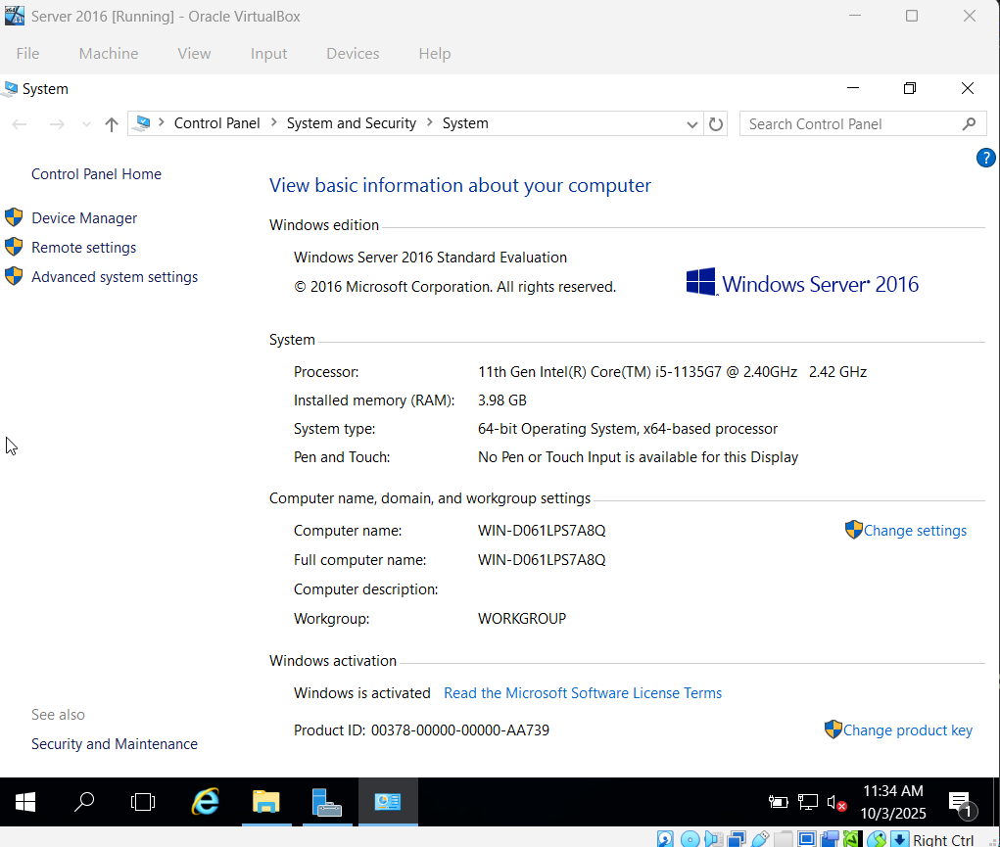
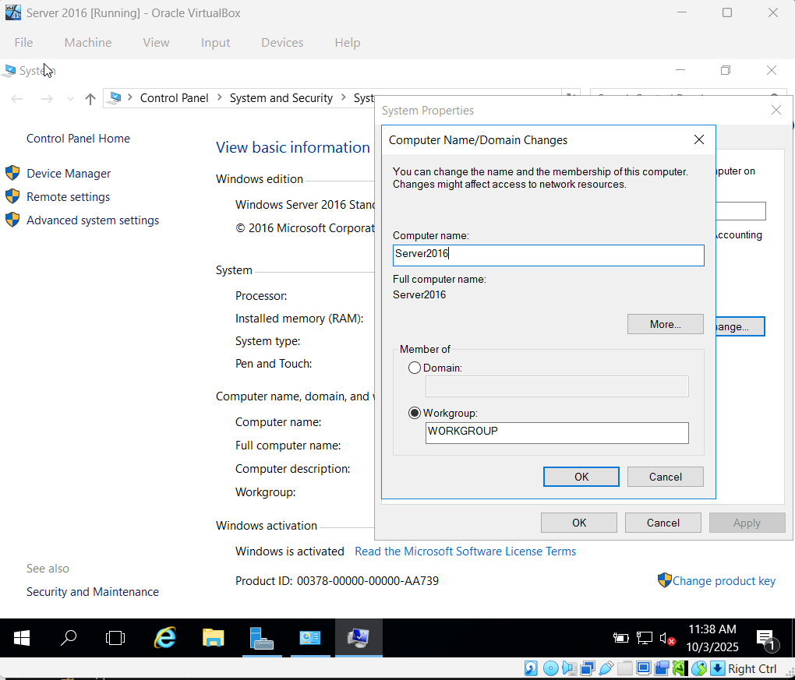
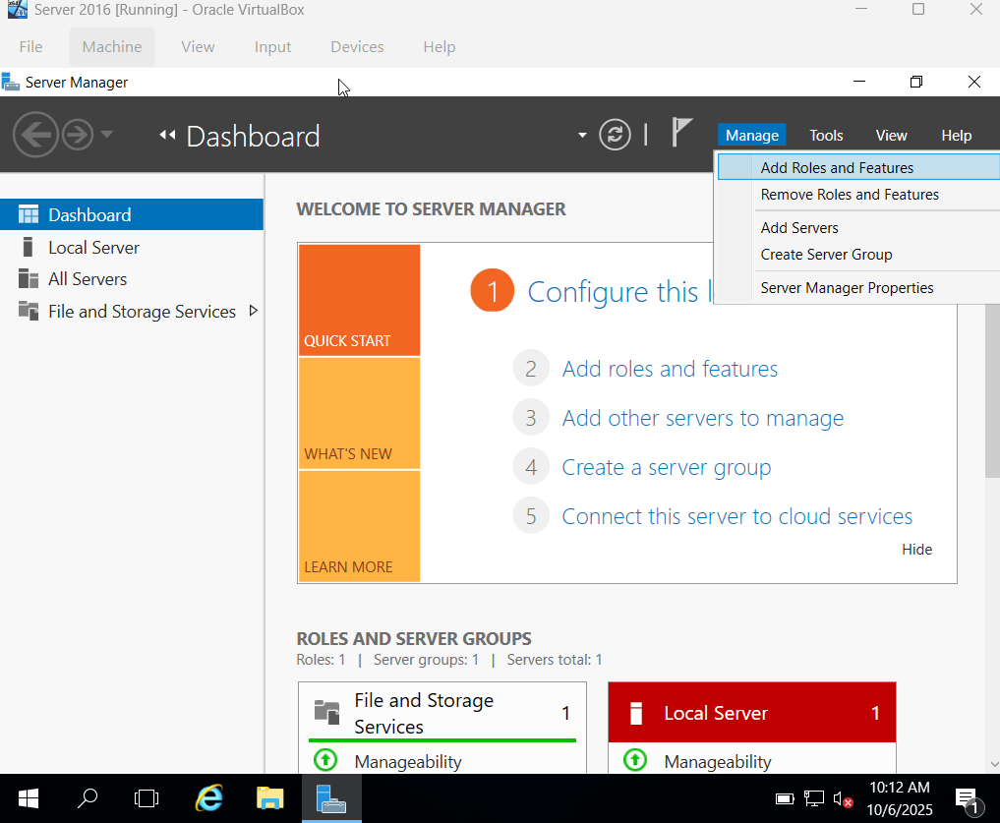
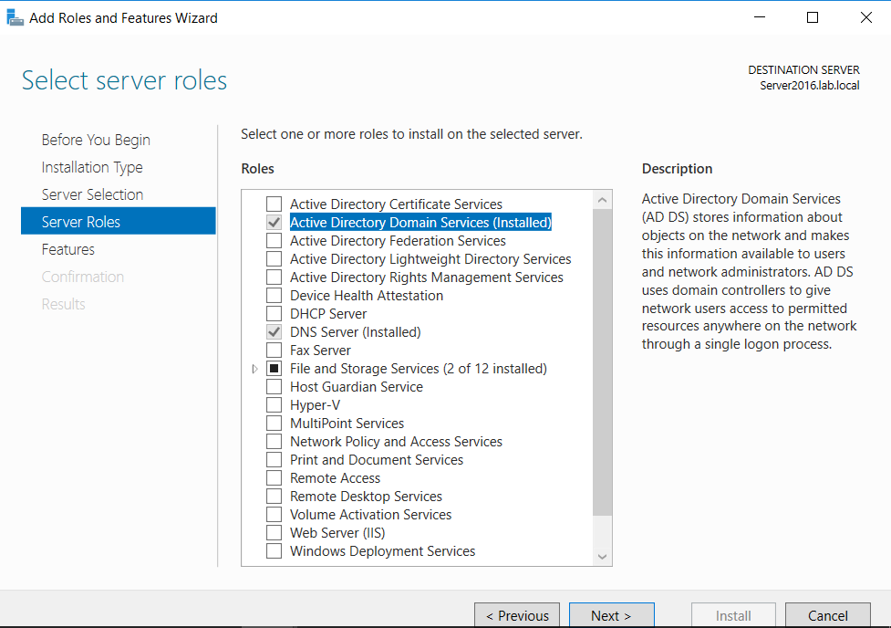
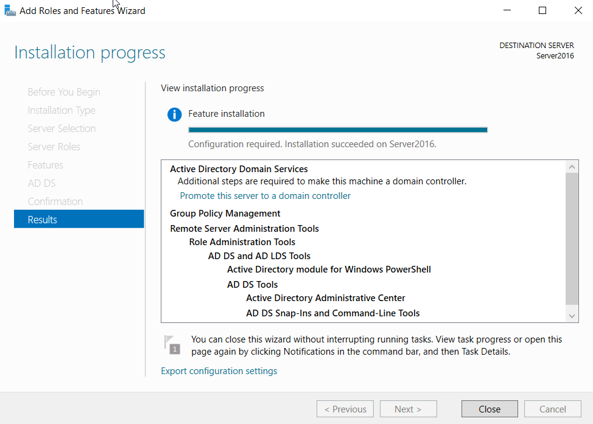
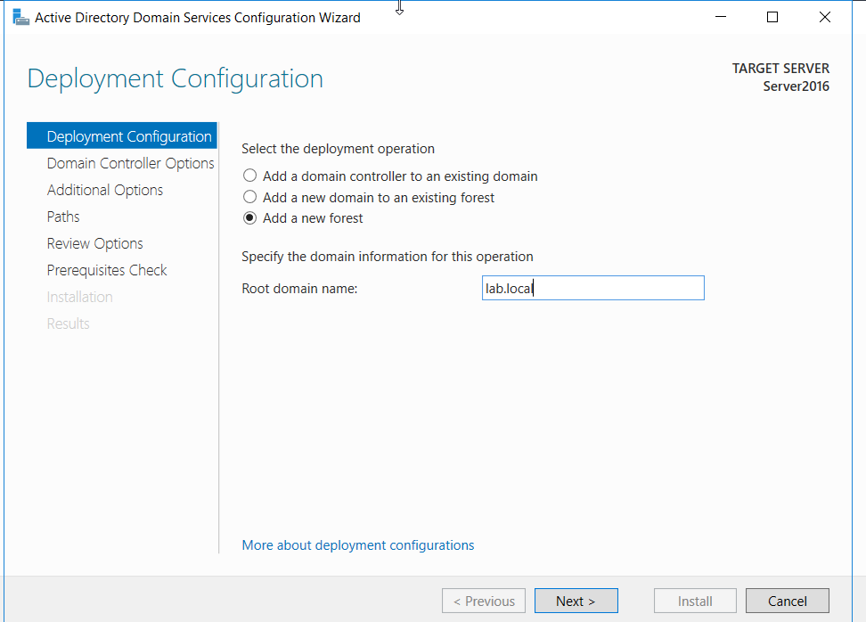
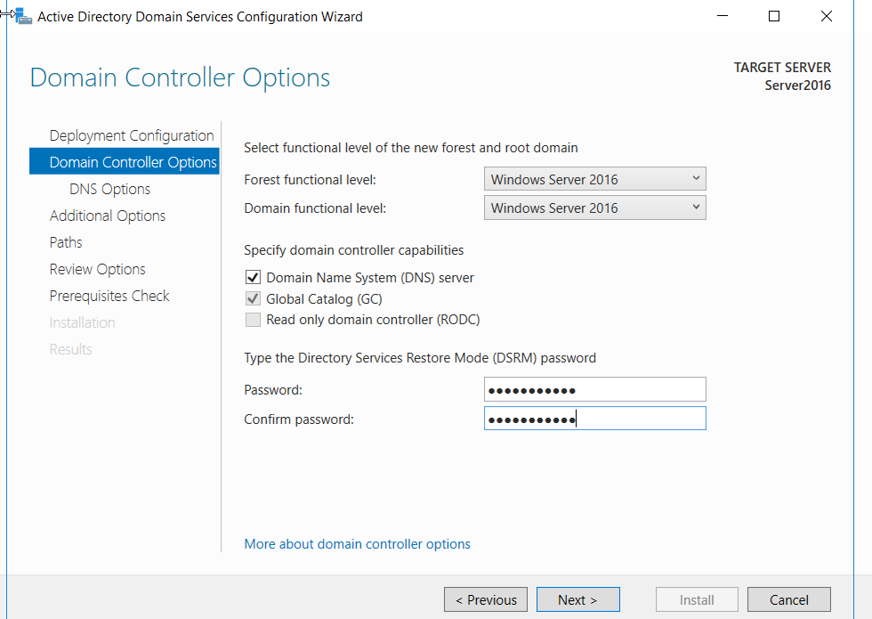

# Renaming Server and Installing Active Directory

## Renaming Server(Computer name)

1. Navigate to File Explorer on taskbar -> Right-click "This PC" -> Select Properties

2. In "Computer name, domain, and workgroup settings", select "Change Settings" -> select "Change"

3. Change Computer name and click "OK", the system will restart shortly after

## Installing Active Directory
Active Directory(AD) - is the backbone of many IT environments, providing a centralized way to manage users, computers, and resources within a network. Whether in a small business or a large enterprise, AD plays a crucial role in ensuring that the right people have access to only the required resources. Understanding the basics of Active Directory is essential for anyone working in system administration, cybersecurity, or IT support

Domain - logical grouping of network objects such as users, computers, printers, and groups that share a common security database.

Domain Controller - Domain Controller is the specific server that runs the software (like Active Directory Domain Services) to manage that domain. 

1. Navigate to Server Manager and select "Add Roles and Features"

2. In "Add Roles and Features Wizard",
- In Server Roles, select "Active Directory Domain Services"
- Leave Default setup , and select "Install"

3. After installation complete, Select "Promote this server to a domain controller"

4. In "Active Directory Domain Services Configuration Wizard",
- In Deployment Configuration, select "add a new forest" and create a root domain name (ending in .local/.com/.org)

- In Domain Controller Options, create a Directory Services Restore Mode (DSRM) password

- Leave Default setup , and select "Install" 
