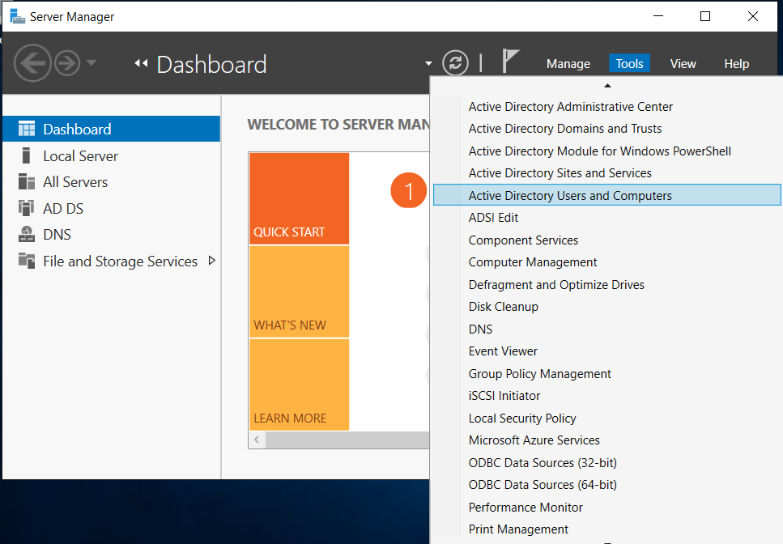
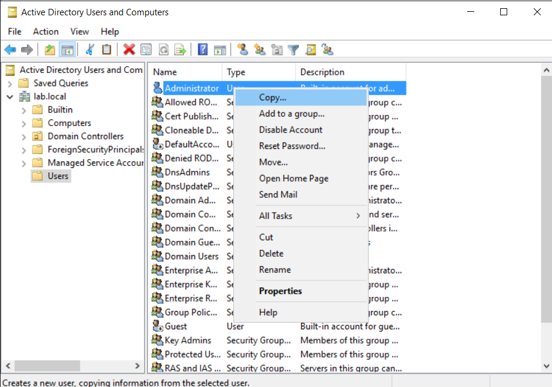
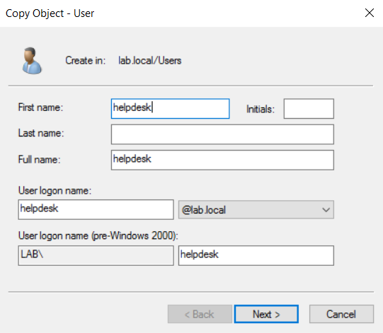

# AD Account Creation

## Acount Creation: Creating helpdesk user with Admin properties

1. Navigate to Server Manager -> Tools -> select "Active Directory Users and Computers"

2. In Domain -> Users -> Right-click on "Administrator" user -> select "Copy"

3. Create "helpdesk" user with username and password

