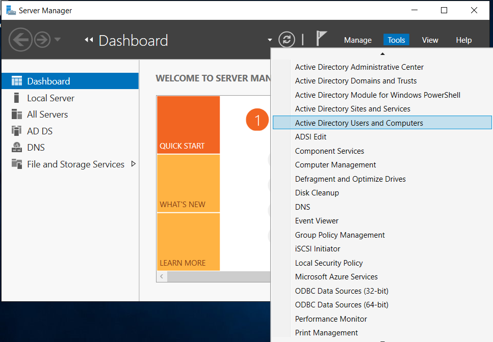
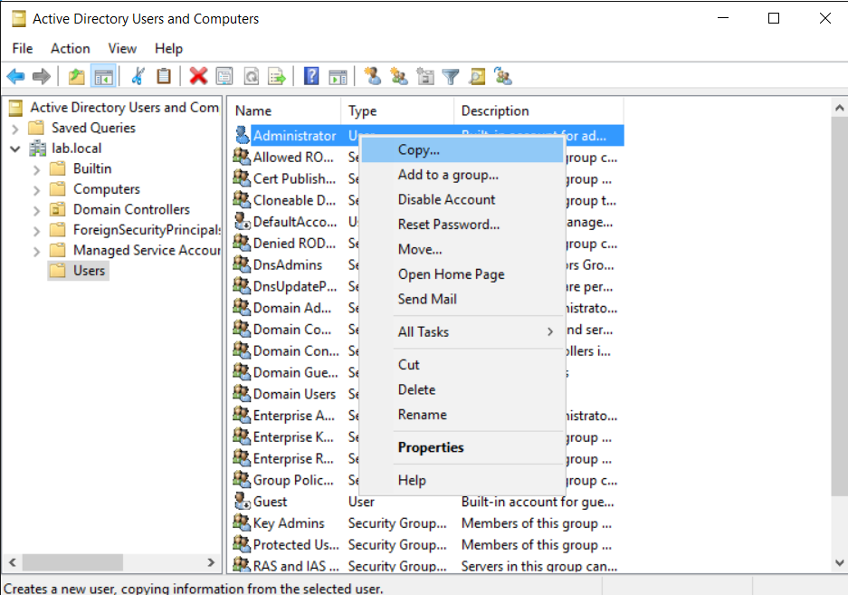
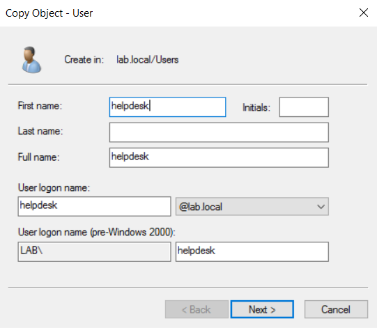

# Active Directory(AD) Account Creation

## Acount Creation: Creating helpdesk user with Admin properties

1. Navigate to Server Manager -> Tools -> select "Active Directory Users and Computers"

2. In Domain(Ex: lab.local) -> Users -> Right-click on "Administrator" user -> select "Copy"

3. Create a "helpdesk" user with username and password credentials   

