# Introduction to Group Policy Management and Domain Integration of another Windows PC (Desktop 2)

## Organizational Unit(OU) and Group Policy Management(GPO) in Windows 10 (Desktop 1)
 
### Create OU/Users in Desktop 1
Note: 
- OU is used to organize users,groups, and computers in order to delegate administrative tasks

1. In Desktop 1, logged in as "helpdesk", navigate to Active Directory Users and Computers

2. Right-click Domain(Ex: lab.local) -> New -> Organizational Unit
- Create an OU

3. Right-click Users -> New -> User
- Create a User with username and password

4. Drag new User created into new OU created

5. Repeat steps 2 and 4 for IT(OU) and User(helpdesk)

### Group Policy Management Intro with Account Lockout Policy (GPO) in Desktop 1
Note:
- Group Policy allows administrators to enforce specific settings and configurations on users and computers, like passwords.

1. Navigate to "Group Policy Management" -> Domain -> right-click Default Domain Policy -> Edit
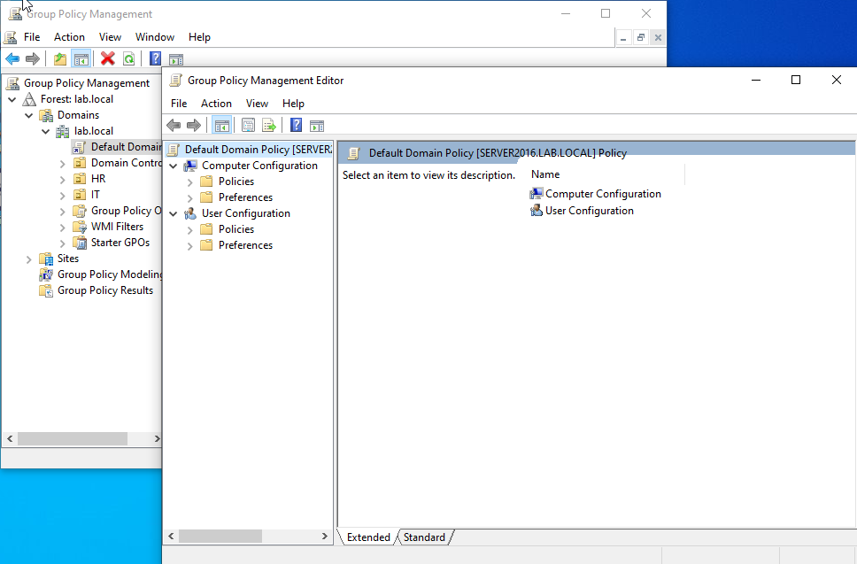

2. For Account Lockout Policy, navigate to Computer Configuration -> Policies -> Windows Settings -> Security Settings -> Account Policies -> Account Lockout Policy
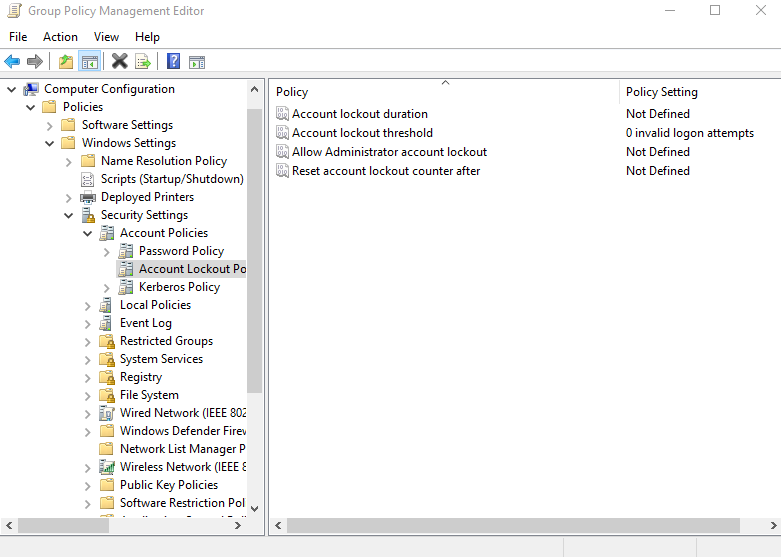

3. In Account Lockout Policy, do the following:

- Change Account lockout duration
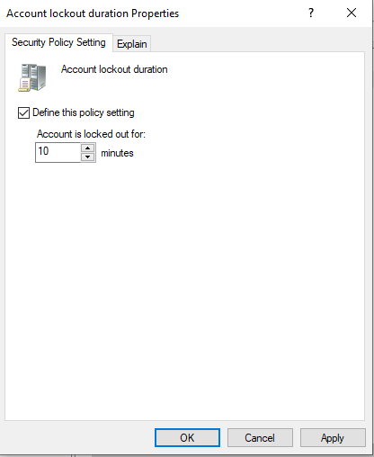

- Change Account lockout threshold
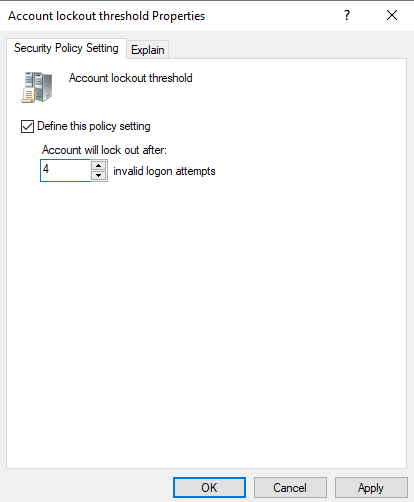

- Reset account lockout counter after
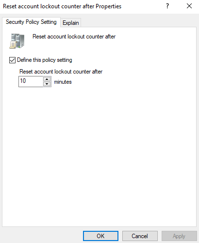

4. To See Group Policy report summary, navigate to "Group Policy Management" -> Domain -> Default Domain Policy -> Settings
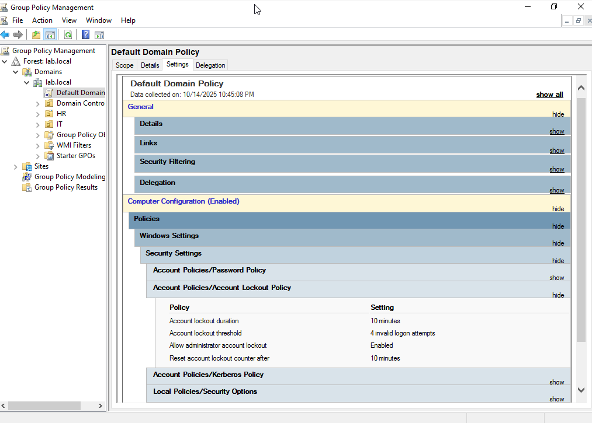

## Windows 10 Client (Desktop 2) Setup

### VirtualBox Setup

1. Open VirtualBox
- Create new Virtual Machine
- name: Desktop 2
- Type: Windows 10(64-bit)
- Setup VM Operating System, password and specify virtual hardware and diskware

2. Power on VM
- Add downloaded Windows Server ISO image To Boot up Windows

### Desktop 2 Experience Setup

1. In Windows Setup,
- Select with Windows Server Desktop Experience
 

- Select Custom Install Windows only
 

- Proceed With Default Setup

2. In Customize Settings, Create Administrator username and password

### Desktop 2 Advanced Settings Setup 

1. To rename Windows Computer, navigate to file explorer -> right-click "This PC" -> Properties -> "Rename This PC"
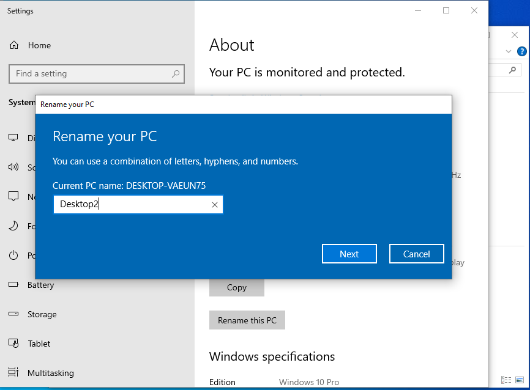

2. To activate Admin account, navigate to file explorer -> right-click "This PC" -> Manage -> System Tools -> Local Users and Groups -> Users
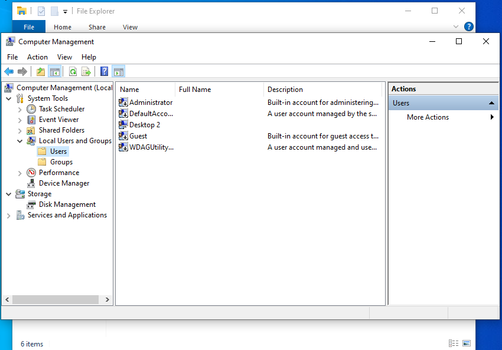

- Enable Administrator Account and setup password
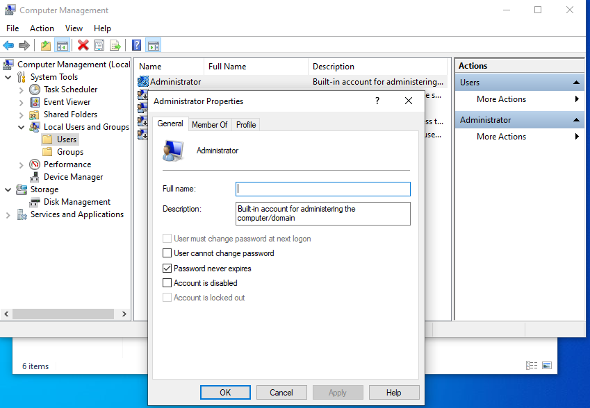
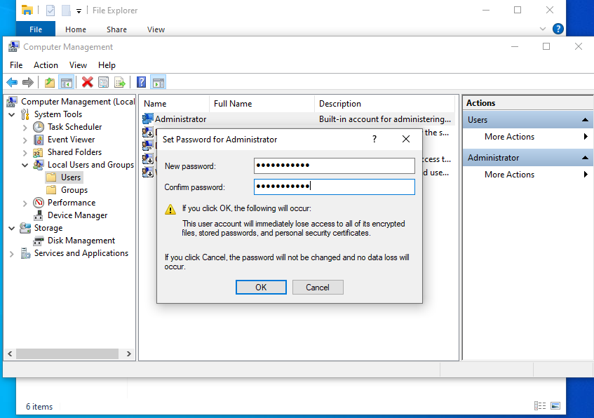

- Sign-out and sign-in as Administrator

3. To Remove user account (desktop 2), navigate to file explorer -> right-click "This PC" -> Properties -> advanced system settings -> User Profiles "Settings" -> Select and Delete User account
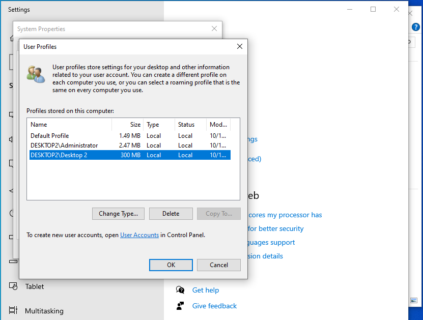

## Join Desktop 2 to Windows Server Domain 

1. To create a static IP address, navigate to Control Panel -> select "Network and Internet: View network status and tasks" -> "change adapter settings" -> "Ethernet" -> "Properties" -> select "TCP/IPV4"

2. In TCP/IPV4 properties,
- select "use the following IP address"
- Fill in the following IP address and DNS server address credentials
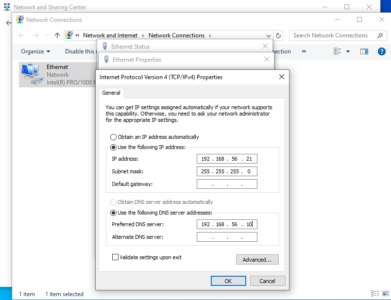

3. Navigate to Devices (Top Panel) -> Network -> Network Settings -> Change Network Adapter to "Host-only Adapter" (This should be done for both Windows VM and Windows Server VM)
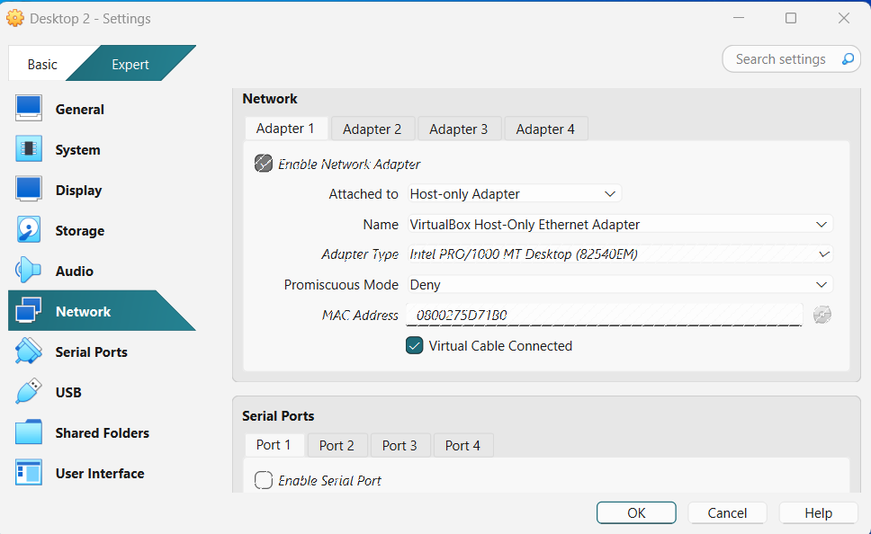

4. Navigate to File explorer -> right-click "This PC" -> Properties -> "Rename This PC (advanced)" -> Change -> Select "domain", add domain name and enter admin credentials
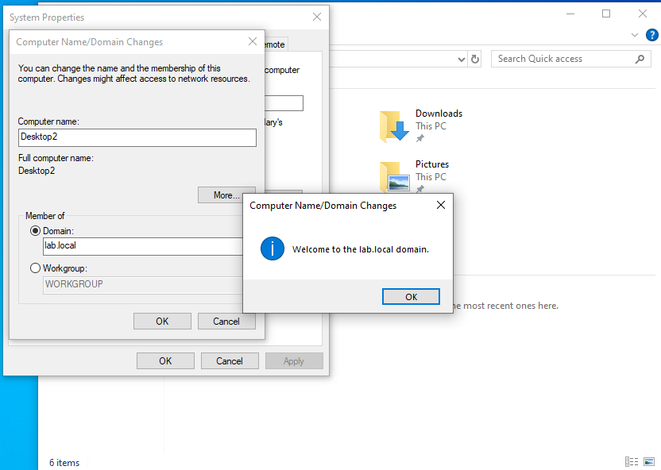

5. To Confirm domain integration is successful, try logging in with a a User accounted created in the Windows Server Domain 

