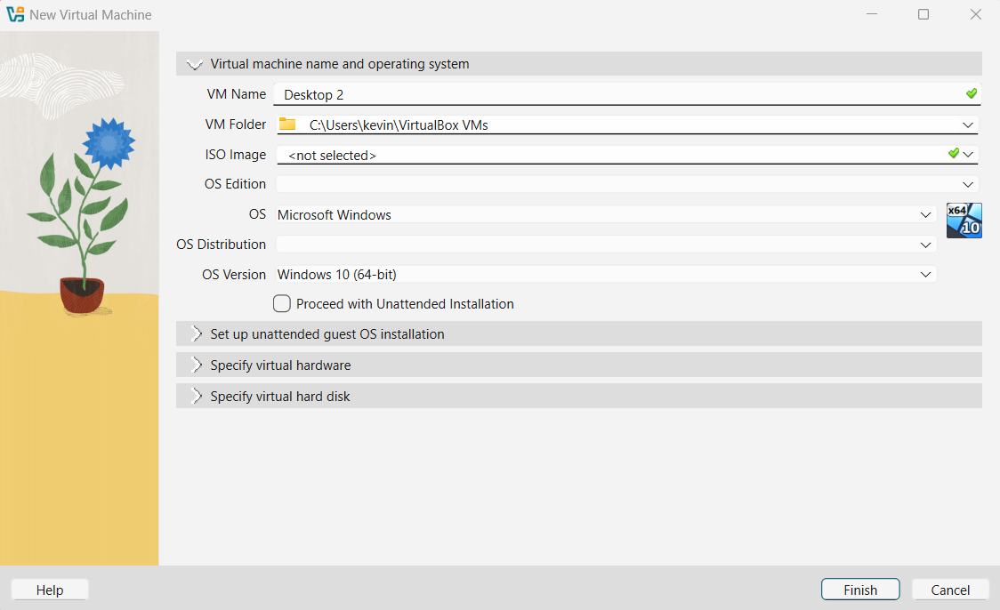
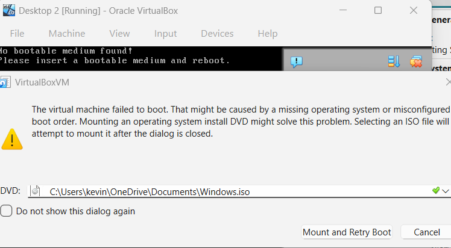
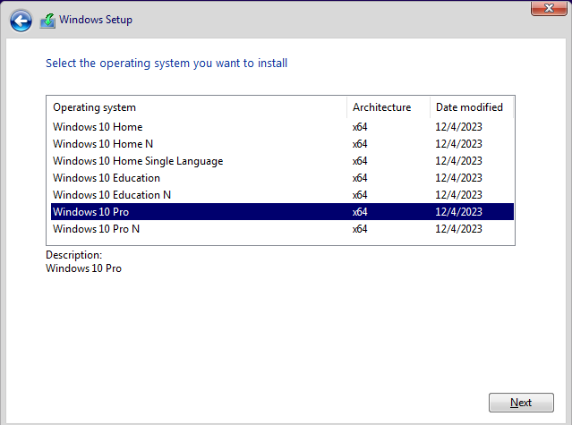
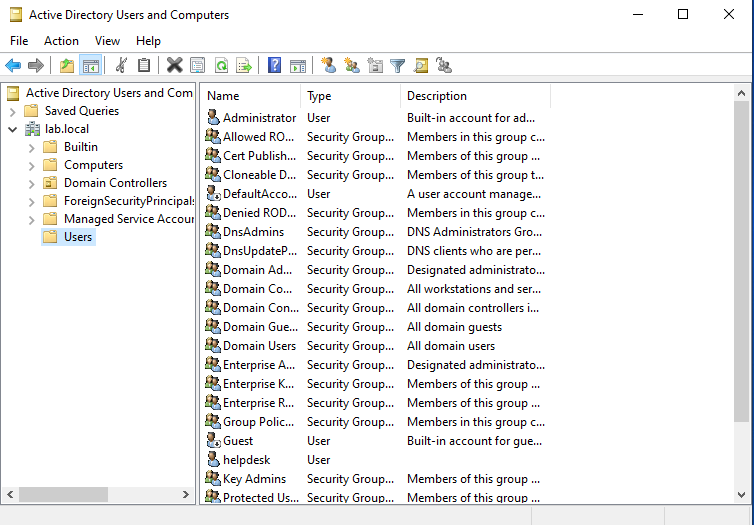
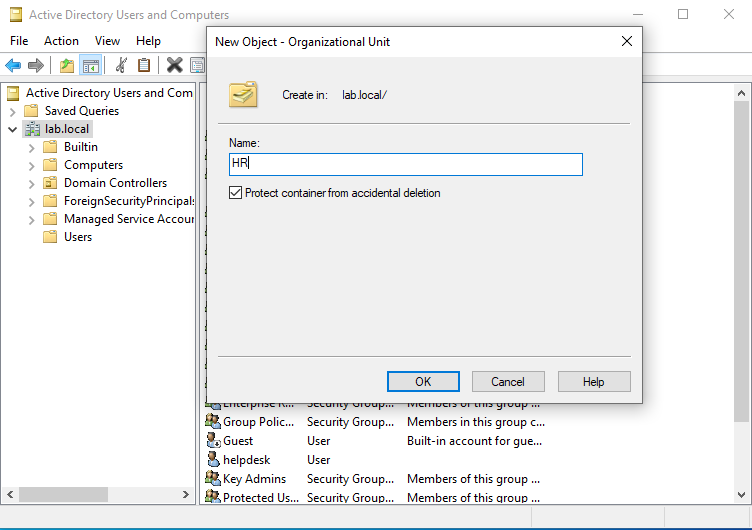
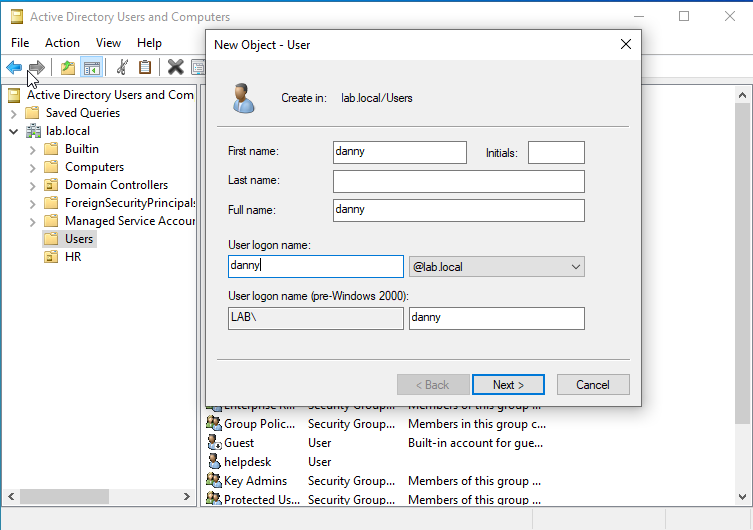
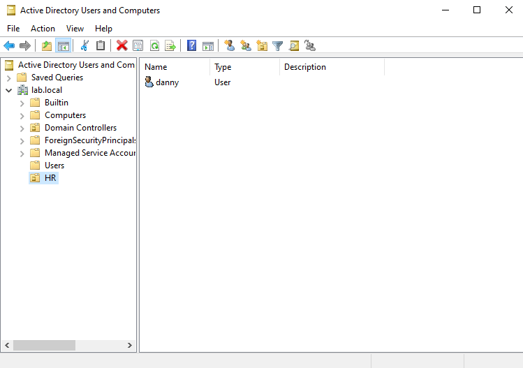
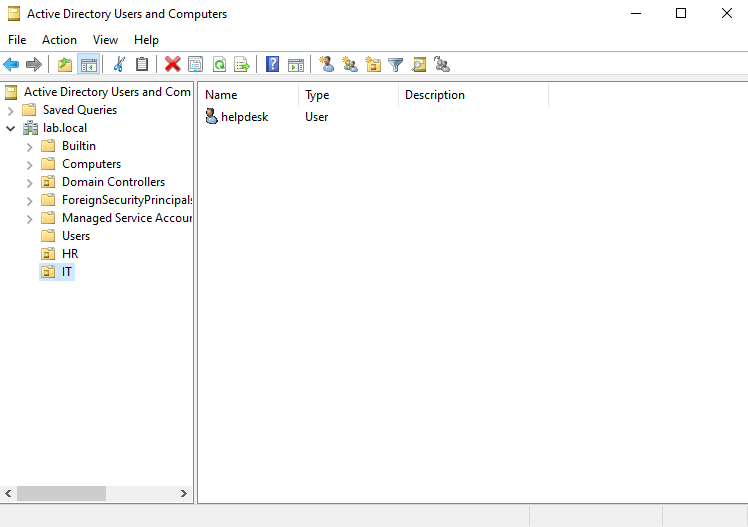
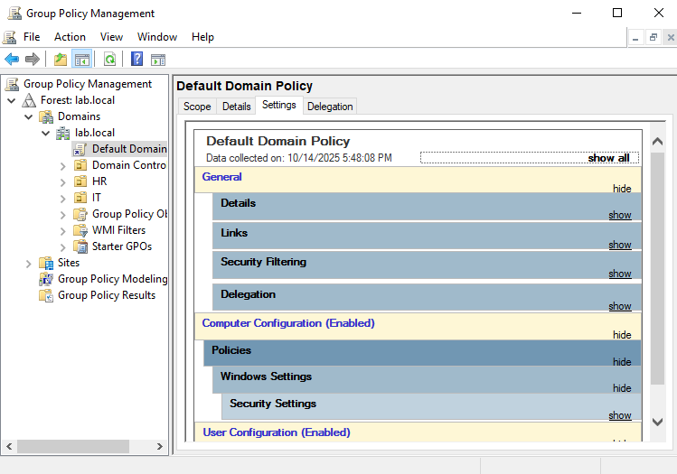

# Join another Windows 10 PC to a Domain and Group Policy

## Windows 10 Client (Desktop 2) Setup

### VirtualBox Setup

1. Open VirtualBox
- Create new Virtual Machine
- name: Desktop 2
- Type: Windows 10(64-bit)
- Setup VM Operating System, password and specify virtual hardware and diskware

2. Power on VM
- Add downloaded Windows Server ISO image To Boot up Windows

### Desktop Experience Setup

1. In Windows Setup,
- Select with Windows Server Desktop Experience
 

- Select Custom Install Windows only
 

- Proceed With Default Setup

2. In Customize Settings, Create Administrator username and password

### Create OU/Users in Windows 10(Desktop 1) and introducing Group Policy
Note: 
- OU is used to organize users,groups, and computers in order to delegate administrative tasks
- Group Policy allows administrators to enforce specific settings and configurations on users and computers, like passwords.

1. In Desktop 1, logged in as "helpdesk", navigate to Active Directory Users and Computers

2. Right-click Domain(Ex: lab.local) -> New -> Organizational Unit
- Create an OU

3. Right-click Users -> New -> User
- Create a User with username and password

4. Drag new User created into new OU created

5. Repeat steps 2 and 4 for IT(OU) and User(helpdesk)

6. To See a Group Policy Management, navigate to "Group Policy Management" -> Domain -> Default Domain Policy -> Select Settings (To edit policies, right-click Default Domain Policy -> Edit)
