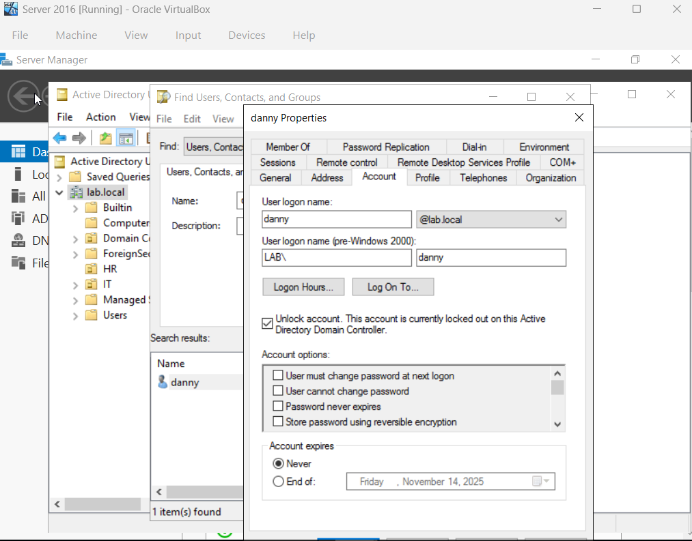
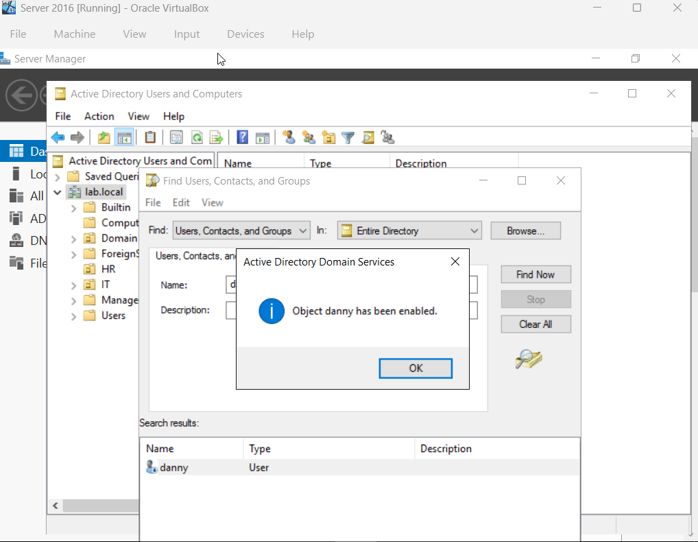
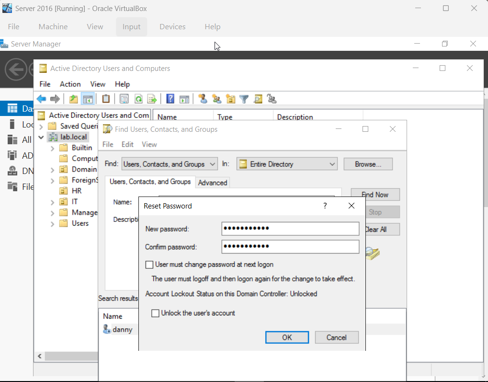
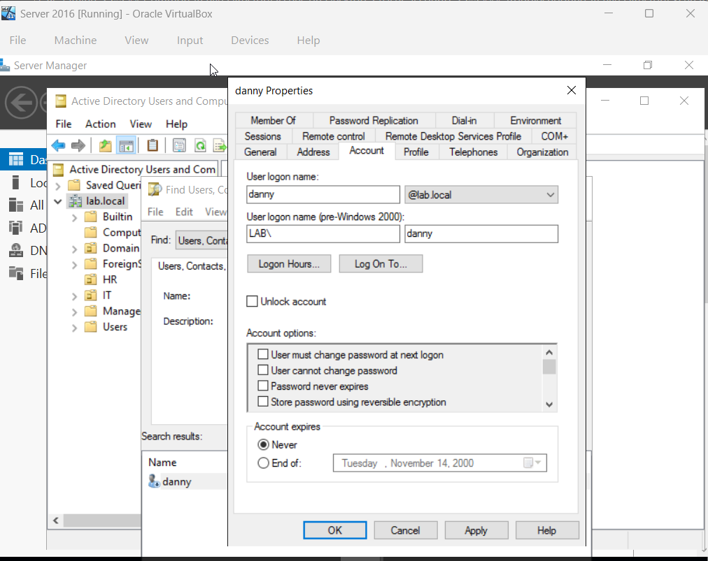
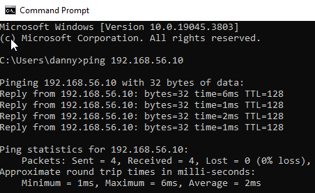
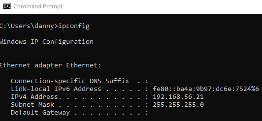
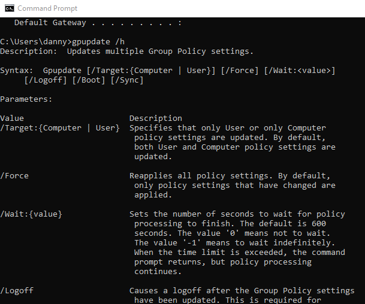
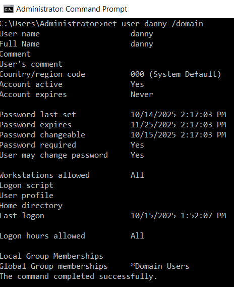

# Common Active Directory Issues , CMD, PC Offline

## Common Active Directory Issues on Desktop 2 (User account)

### Troubleshooting Active Directory Scenarios

1. 
- Scenario (User): User Account is locked out

- Solution (Admin): navigate to Server Manager -> Tools -> Active Directory User and Computers -> right-click domain (Ex: lab.local) -> "Find..." -> Select User account -> Account -> Select "Unlock account"

2. 
- Scenario (User): User account is disabled

- Solution (Admin): navigate to Server Manager -> Tools -> Active Directory User and Computers -> right-click domain (Ex: lab.local) -> "Find..." -> right-click User account -> Select "Enable Account"

3. 
- Scenario (User): User account password needs to be reset

- Solution (Admin): navigate to Server Manager -> Tools -> Active Directory User and Computers -> right-click domain (Ex: lab.local) -> "Find..." -> right-click User account -> Select "Rest Password" -> Reset with temporary password

4. 
- Scenario (User): User Account has expired

- Solution (Admin): Navigate to Server Manager -> Tools -> Active Directory Users and Computers -> right-click domain (Ex: lab.local) -> "Find..." -> Select user account -> Account -> Select either "Never"(password never expires) or "End of"(password expiration date)

5. 
- Scenario (User):
pic

- Solution (Admin):
pic

## Troubleshooting CMD commmands

1. ping- tool used to test if one computer can reach another over a network or the internet. (Ex: Desktop User pings Server IP address/host name)

2. ipconfig - tells you which IP addresses, gateways, and network info your machine is using.

3. /h or /help - display all the available options and switches you can use with that command before it.

4. gpupdate - Group Policy Update, forces your computer to apply the latest Group Policy settings from the domain or local machine.

5. net user(Admin) - tool to view, create, or modify user accounts on a local computer or in a domain (like, password expiration).

