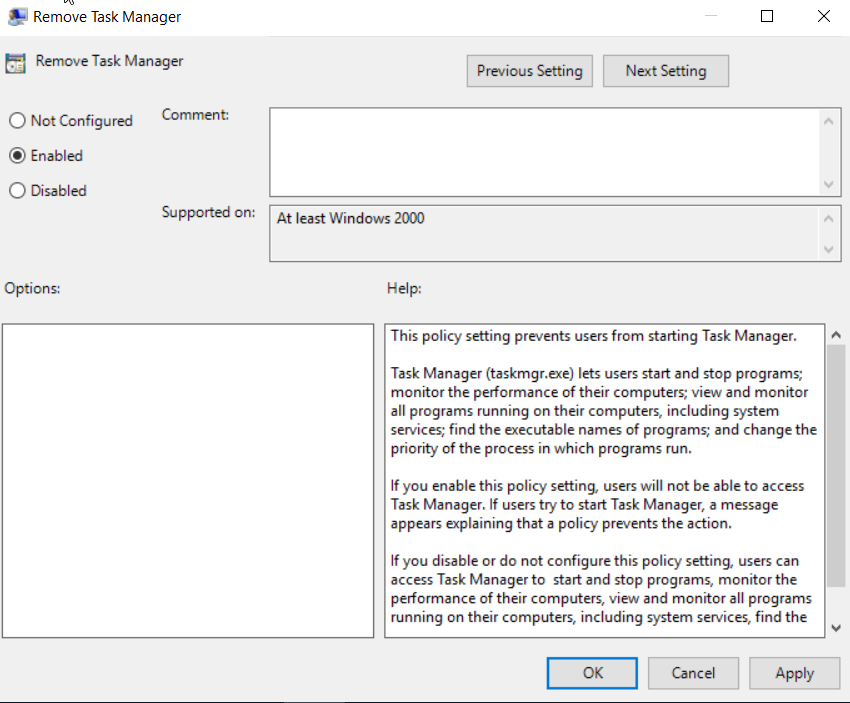
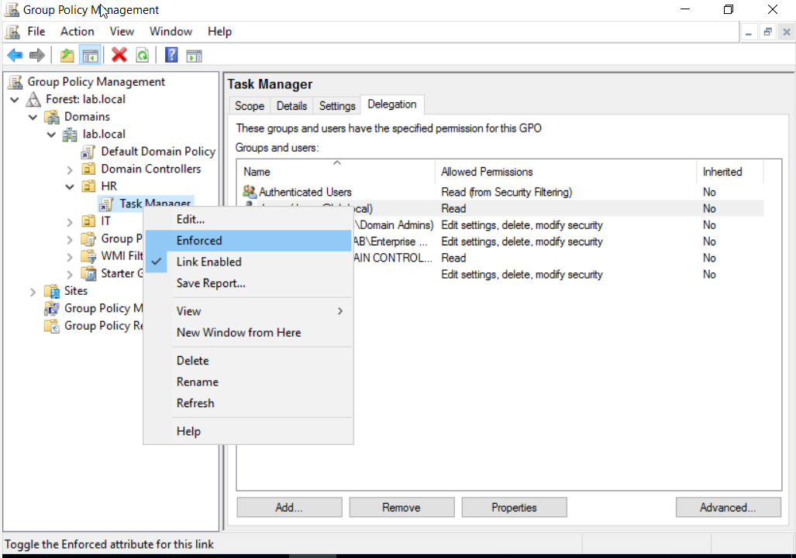

# Group Policy / Task Manager 

## Group Policy
Group Policy - lets IT administrators control what users and computers can do in a network — all from one central location.

### Group Policy CMD commands

1. gpupdate /force- Forces a full refresh of all group policies (even ones that haven’t changed).

2. gpresult /r - Displays a summary of applied policies to the user or computer.

## Task Manager
Task Manager - lets you see and control what’s running on your computer.
It’s like a control center where you can monitor your computer’s performance, apps, and background processes.

### How To Disable Task Manager using Group Policy Management (Windows Server)
1. Navigate to Server Manager -> Tools -> Group Policy Management -> Domains -> Domain name(Ex: lab.local) -> Group Policy Objects

2. Right-click "Group Policy Object" -> New -> Create new "Task Manager" GPO

3. In "Task Manager" GPO -> "Delegation" tab,
- add desktop 2 user (Ex: danny)

4. Right-click "Task Manager" GPO -> "Edit" -> User Configuration -> Policies -> Administrative Templates -> "System" -> "Ctrl+Alt+Del Options"

5. Select Remove Task Manager and Enable it

6. To set a "Task Manager" Group Policy to a group or user,
- In Group Policy Management, drag & drop policy to desired group (Ex: HR)
- Select Group Policy and select "Enforced"

### Test Disabled Task Manager on Desktop 2 

1. In Command Prompt(CMD), run "gpupdate /force" to refresh updated group policies and run "gpresult /r" to confirm Task Manager group policy is applied to the account

2. To Cofirm Task Manager is disabled, 
- double-click taskbar(bottom screen) and Task Manager should be greyed out

- Do Ctrl+Alt+Del and Task Manager should no longer be one of the options 

