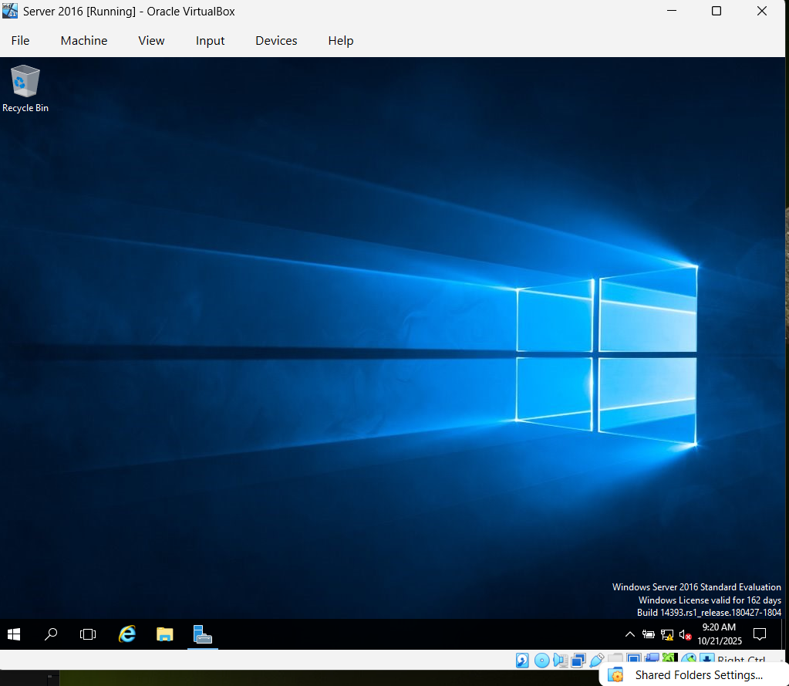
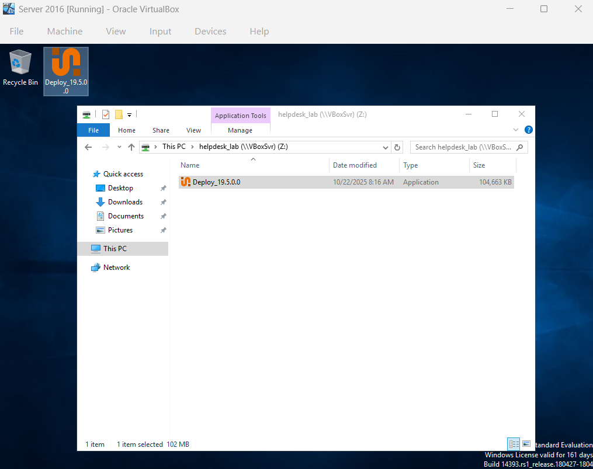
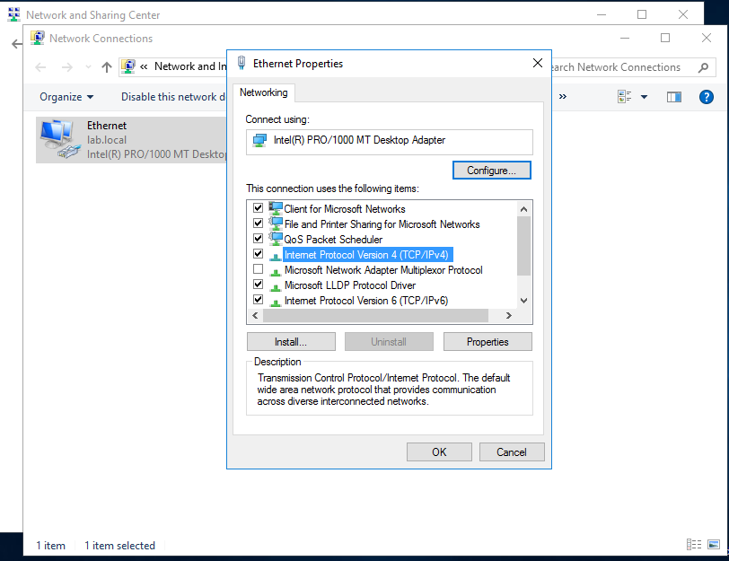

# Installing PDQ Deploy / Deploying PDQ / Software Packages

## PDQ
PDQ - stands for "Pretty Darn Quick", is a pair of Windows systems management tools, PDQ Deploy and PDQ Inventory used by IT professionals to manage and maintain multiple computers remotely.

PDQ Deploy - software deployment tool used by IT administrators to remotely install, update, or uninstall software on multiple computers at once — without having to manually visit each one.

Software Packages - Bundle of files and instructions needed to install a program automatically.

### Installing PDQ Deploy on Windows Server 

1. On Windows Server VM, 
- Navigate to "Devices" tab(on top panel) -> Insert Guest Additions CD image...

2. Navigate to file explorer -> This PC -> select "CD Drive Virtualbox Guest Additions"

2. On VirtualBox Guest Setup, select default setup options, install, and reboot system

3. This application allows us to share documents off of the Virtual Machine(from our host copmuter), since our VM's are not using Wifi, therefore cannot install applications on there own

4. To Create a Shared folder with our host computer,
- Navigate to "Shared Folder Settings"(on bottom right panel of VM)
 

- In Shared Folder Settings, add a Share Folder -> Create a new folder(Ex: helpdesk lab ) -> select "Auto mount" -> click "OK"

- On File explorer, you should see the new shared folder under "Network Locations"

5. On your Host Computer,
- Navigate to a web browser, sign up and install PDQ deploy on PDQ installation page. Also place downloaded file in the shared folder (Ex: helpdesk lab)

6. To temporarily put Server on the network and install PDQ deploy, On Windows Server:
- refresh file explorer and place it on the desktop

- Navigate to "Devices" tab(on top panel) -> Network -> set Network to "Bridged Adapter" 

- Navigate to Control Panel -> "View network status and tasks" -> "Change adapter settings" -> right-click Ethernet -> Properties -> Internet Protocol Version 4(TCP/IPv4)

- On TCP/IPv4 Properties, select "Obtain an IP address automatically" and "Obtain DNS server address automatically" (Tip: save static IP address credentials for later)

- To confirm the server has network run on CMD, "ping 8.8.8.8", and you should get replies from the network

### Deploying PDQ on Windows Server (Installing PDFsam Basic application To the Windows Server using PDQ deploy)

1. Select PDQ Deploy file on your desktop and install Microsoft .NET framework 

2. PDQ Deploy Setup, install default setup and launch PDQ Deploy (the new one, the old on can be recycled or deleted)

3. To install PDFsam Basic, navigate to Package Library and download PDFsam Basic
 

4. To Deploy PDFsam Basic to a machine:
- Navigate to "Packages" folder" -> right-click "PDFsam Basic" -> Deploy Once -> select "Choose Target" -> Active Directory -> Computers

- In "Select AD Target", move SERVER2016 to the Targets table click "OK", and select "Deploy now"

- After the deployment, PDF Basic should appear on Server 2016's Desktop

5. To take Windows Server back off the network: 
- Navigate to Control Panel -> "View network status and tasks" -> "Change adapter settings" -> right-click Ethernet -> Properties -> Internet Protocol Version 4(TCP/IPv4)

- On TCP/IPv4 Properties, fill original static IP address credentials

- Navigate to "Devices" tab(on top panel) -> Network -> set Network to "Host-Only Adapter" 

- To confirm everything is back its original settings, in CMD ping your domain and you should get replies
