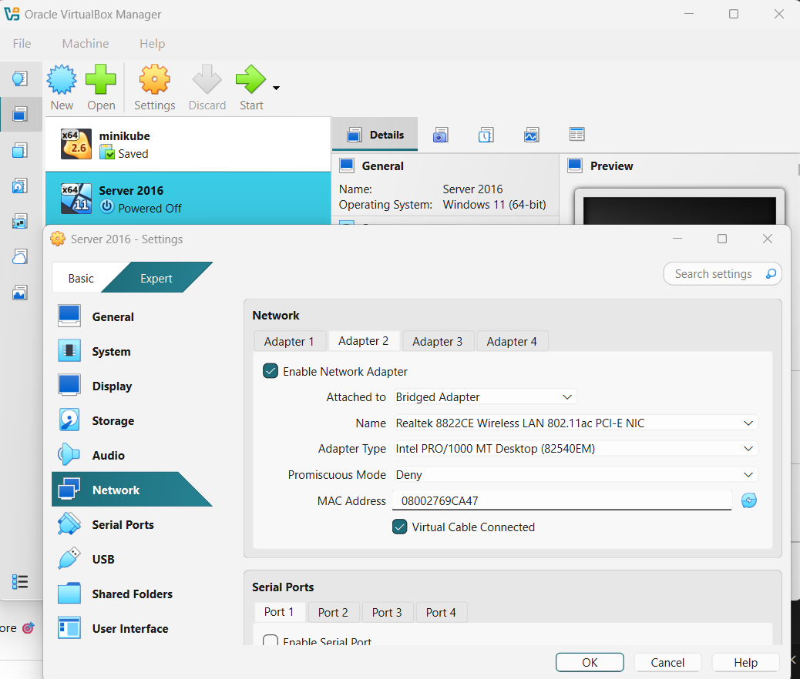
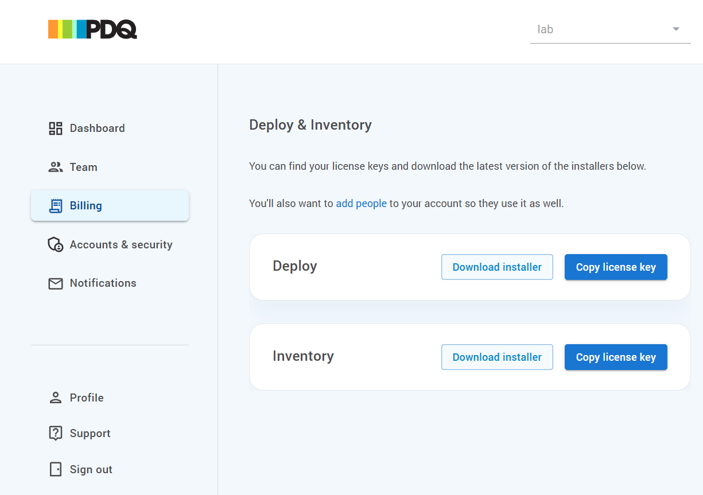
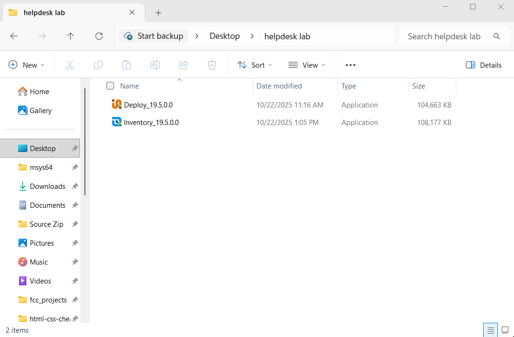

# PDQ Inventory / Hardware Inventory / Applications

## PDQ Inventory
PDQ Inventory - system management and auditing tool used by IT professionals to collect, organize, and monitor detailed information about all the computers in a network.

### How to Setup a second Network Interface Card on Windows Server VM
Tip: We want to have a Host-Only adapter to have our server and clients talk to each other privately(but it disconnects from the internet), but we also want a Bridged adapter that connects our VM to our real home network (through your host’s Wi-Fi or Ethernet). This allows us to no longer need to switch or change IPs each time we want to go online.

1. To enable a Bridged adapter as our 2nd adapter:
- Power off your VM.
- Go to Settings → Network.
- Under Adapter 1, keep your Host-Only Adapter (static IP setup).
- Enable Adapter 2 → Check “Enable Network Adapter.”
- Set Attached to: → Bridged Adapter.
- Choose your host’s real network adapter (e.g., your Wi-Fi card).

### Installing PDQ Inventory on Windows Server 

1. On your Host Computer,
- Navigate to a web browser, sign up and install PDQ Inventory on PDQ installation page. Also place downloaded file in the shared folder (Ex: helpdesk lab)

2. To install PDQ deploy, On Windows Server:

- refresh file explorer and place it on the desktop
pic
