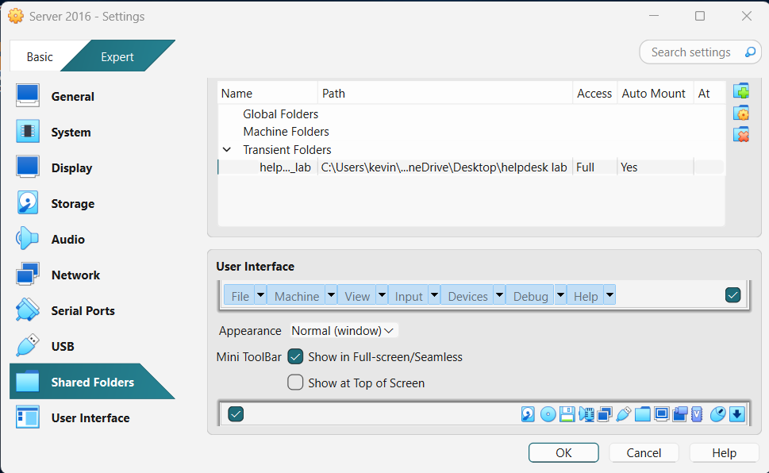

# PDQ Inventory 

## PDQ Inventory
PDQ Inventory - system management and auditing tool used by IT professionals to collect, organize, and monitor detailed information about all the computers in a network.

### How to Setup a second Network Interface Card on Windows Server, Windows 10 (Desktop 1: Helpdesk), and Windows 10 (Desktop 2: User) VM's
Tip: We want to have a Host-Only adapter to have our server and clients talk to each other privately(but it disconnects from the internet), but we also want a Bridged adapter that connects our VM to our real home network (through your host’s Wi-Fi or Ethernet). This allows us to no longer need to switch or change IPs each time we want to go online.

1. To enable a Bridged adapter as our 2nd adapter:
- Power off your VM.
- Go to Settings → Network.
- Under Adapter 1, keep your Host-Only Adapter (static IP setup).
- Enable Adapter 2 → Check “Enable Network Adapter.”
- Set Attached to: → Bridged Adapter.
- Choose your host’s real network adapter (e.g., your Wi-Fi card).

### Installing PDQ Inventory on Windows Server 

1. On your Host Computer,
- Navigate to a web browser, sign up and install PDQ Inventory on PDQ installation page. Also place downloaded file in the shared folder (Ex: helpdesk lab)

2. To install PDQ Inventory, On Windows Server:

- Navigate to Shared Folders in File Explorer (Tip: Make sure shared folder is being shared by navigating to Shared Folder settings)

- refresh file explorer and place it on the desktop

- PDQ Inventory Setup, install default setup and launch PDQ Inventory (the new one, the old on can be recycled or deleted)

- In order to launch PDQ Inventory, proceed with free trial version and enter admin credentials in order to launch

### How to use PDQ Inventory on Windows Server 

1. To add a Computer to your PDQ Inventory in order to see it's general settings: 
- Right-click on "All Computers" -> Add Computers -> "Active Directory -Browse by Name" -> Drag Desired Computer to the targets section and click "OK" (Ex: Desktop2)

2. In order to see a Computers general settings(like IP,Memory,OS,apps etc):
- Navigate to "All Computers" -> select Computer (Ex: Desktop2) (left panel shows Computers apps, hardware, Groups they are apart of, etc)

3. PDQ inventory can access the following of another computer on the Network: 
- Shares: Share Files to specific computer
- Windows feature: enable applications
- Printers: Check what devices are connected to the computer
- Remote Desktop
- Reboot or shutdown a computer
- Run a basic report of a computer 
- Access PDQ Deploy to deploy applications to a computer
- and much more!!!
