# Printer Set Up On Windows Server 2016 / NTFS / Printer Cloud

## Printer Set Up On Windows Server

### Installing Printer Services on the Server

1. Navigate to Server Manager -> "Manage" tab -> Add Roles and Features
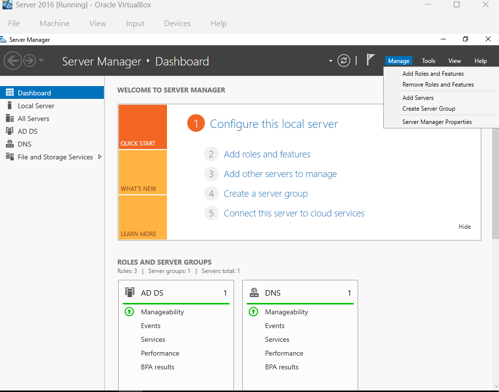

2. In Add Roles and Features Wizard: 
- In Server Roles: add "Print and Document Services"
- Leave Default setup and select "Install
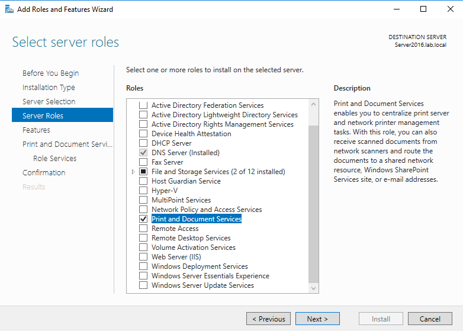

### Create A Printer on the Server

1. On Server Manager, navigate to "Tools" tab -> Print Management
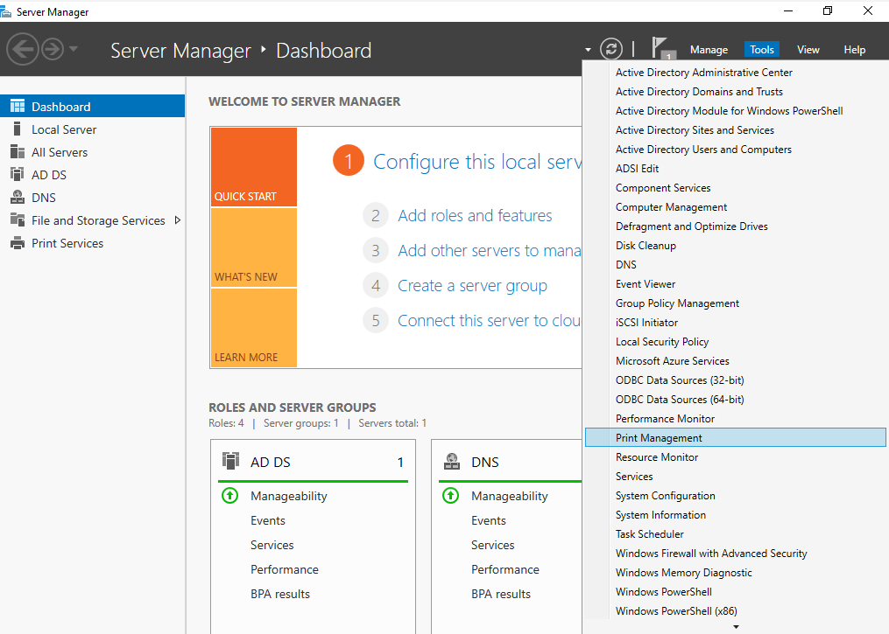

2. On Print Management, navigate to Print Server -> Server(Ex: Server2016) -> right-click Printers -> Add Printer
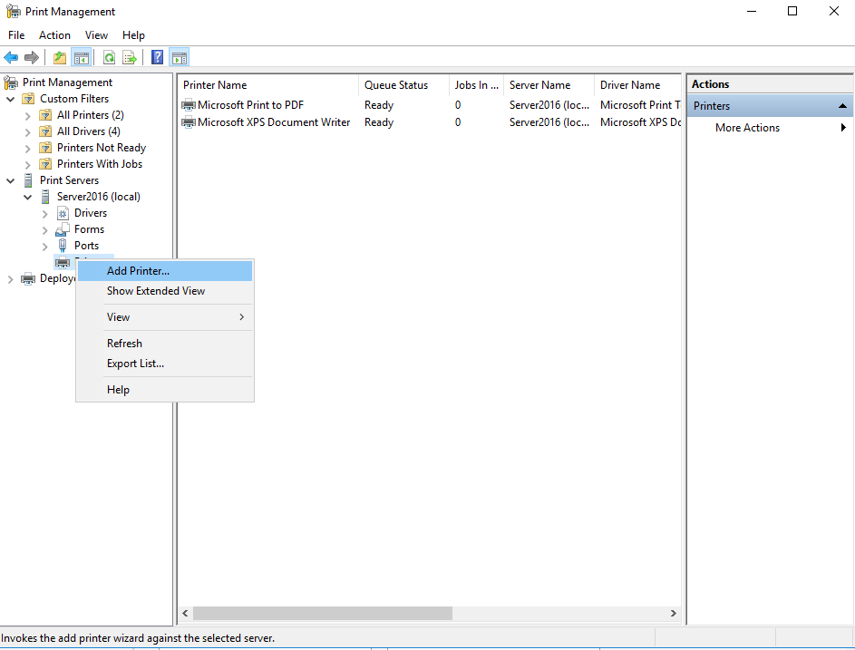

3. In Network Printer Installation Wizard:
- select "Add a new printer using an existing port"

- select "Install a new driver"
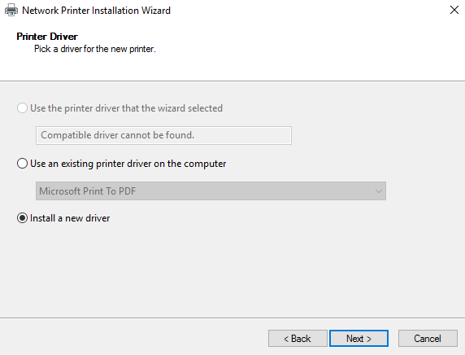

- select a Manufacturer and a Printer name from the list given
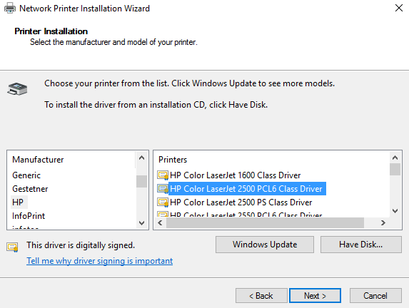

- Uncheck "Share Printer" option
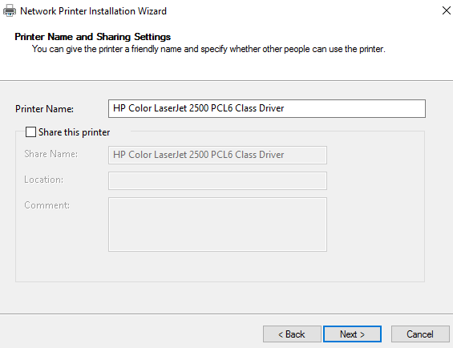

- Finish installation

### Assigning a Printer to a Certain Group (Example: HR)

1. In Print Management, right-click Printer name -> Properties
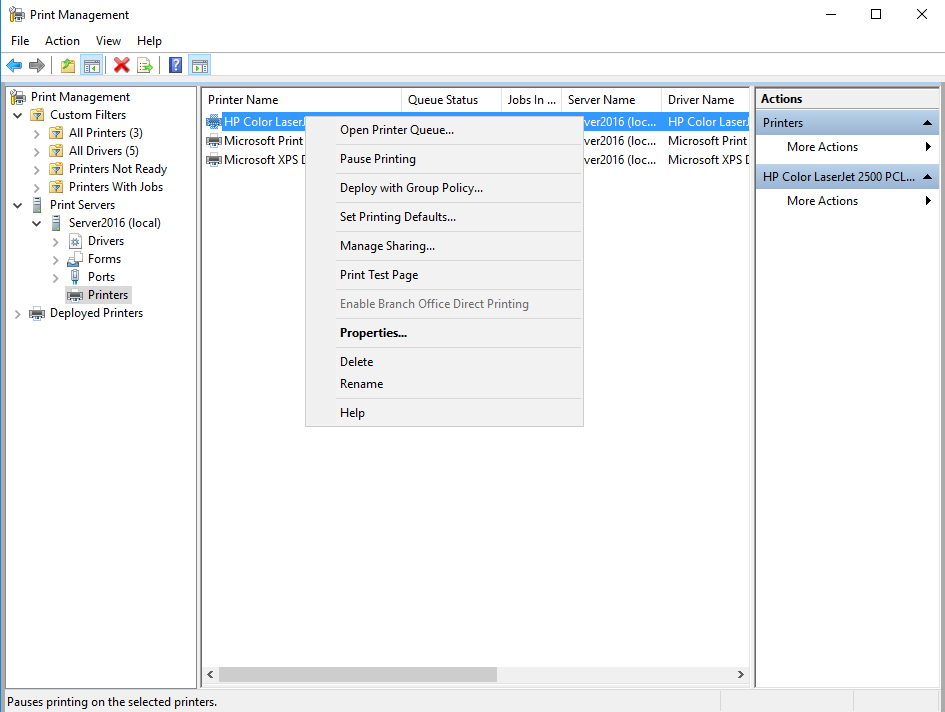

2. In Printer Driver Properties, navigate to "Sharing" tab -> Check "Share this printer" and "List in this directory"
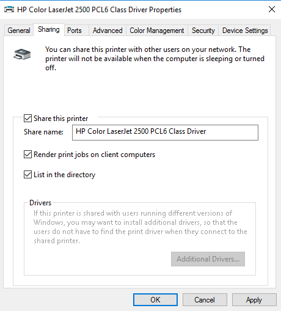

3. In Printer Driver Properties, navigate to "Security" tab -> select "Advanced" 
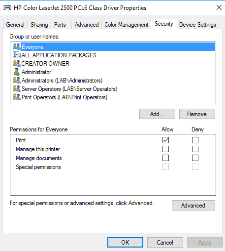

4. In Advanced Security Settings, select "Add" -> "Select a principal" -> search and add group (Ex: HR) -> Give them neccessary permissions
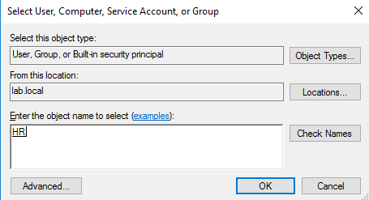

### Adding Printer as a User (in Desktop 2)

