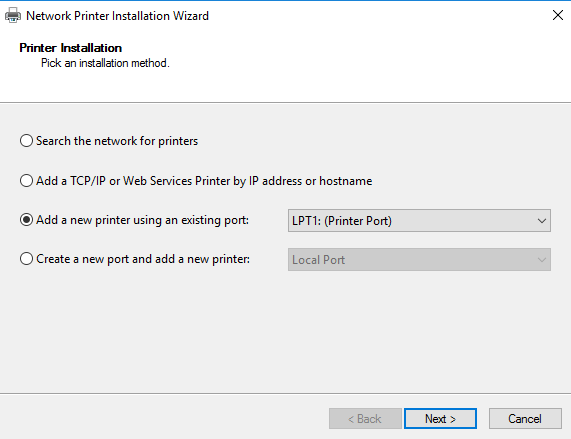
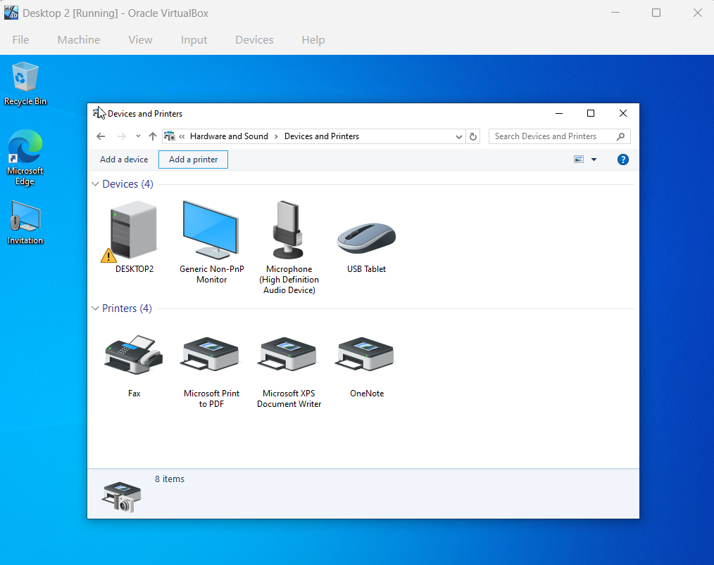
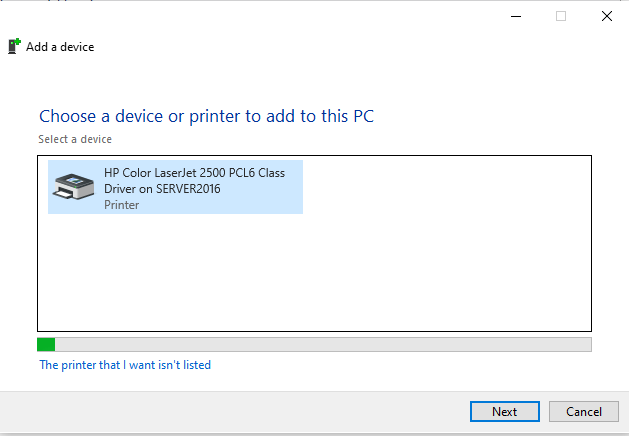

# Printer Set Up On Windows Server 2016 / Printer Cloud

## Printer Set Up On Windows Server

### Installing Printer Services on the Server

1. Navigate to Server Manager -> "Manage" tab -> Add Roles and Features

2. In Add Roles and Features Wizard: 
- In Server Roles: add "Print and Document Services"
- Leave Default setup and select "Install

### Create A Printer on the Server

1. On Server Manager, navigate to "Tools" tab -> Print Management

2. On Print Management, navigate to Print Server -> Server(Ex: Server2016) -> right-click Printers -> Add Printer

3. In Network Printer Installation Wizard:
- select "Add a new printer using an existing port"

- select "Install a new driver"

- select a Manufacturer and a Printer name from the list given

- Uncheck "Share Printer" option

- Finish installation

### Assigning a Printer to a Certain Group (Example: HR)

1. In Print Management, right-click Printer name -> Properties

2. In Printer Driver Properties, navigate to "Sharing" tab -> Check "Share this printer" and "List in this directory"

3. In Printer Driver Properties, navigate to "Security" tab -> select "Advanced" 

4. In Advanced Security Settings, select "Add" -> "Select a principal" -> search and add group (Ex: HR) -> Give them neccessary permissions

### Adding Printer as a User (in Desktop 2)

1. Navigate to Control Panel -> "Hardware and Sound: View devices and printers" -> "Add a printer"

2. In "Add a device", select the printer you want to add to your computer 

3. Note: If user is not apart of group that the printer was assigned to, the user will not be able to add it to their computer.

## Printer Cloud
Printer Cloud - is a service that lets you send print jobs to a printer from anywhere, using the internet or a cloud platform.

### Popular Cloud Printing Services and how it works

1. The following are popular cloud printing services: 
- HP Smart / HP Cloud Printing
- Epson Connect
- Canon PRINT Cloud
- Microsoft Universal Print (for businesses)

2. How cloud printing services work:
- Printer connects to the internet (via Wi-Fi or Ethernet).
- You log into the printer manufacturer’s cloud account.
- Your device uploads the document securely.
- The cloud service sends it to your printer.