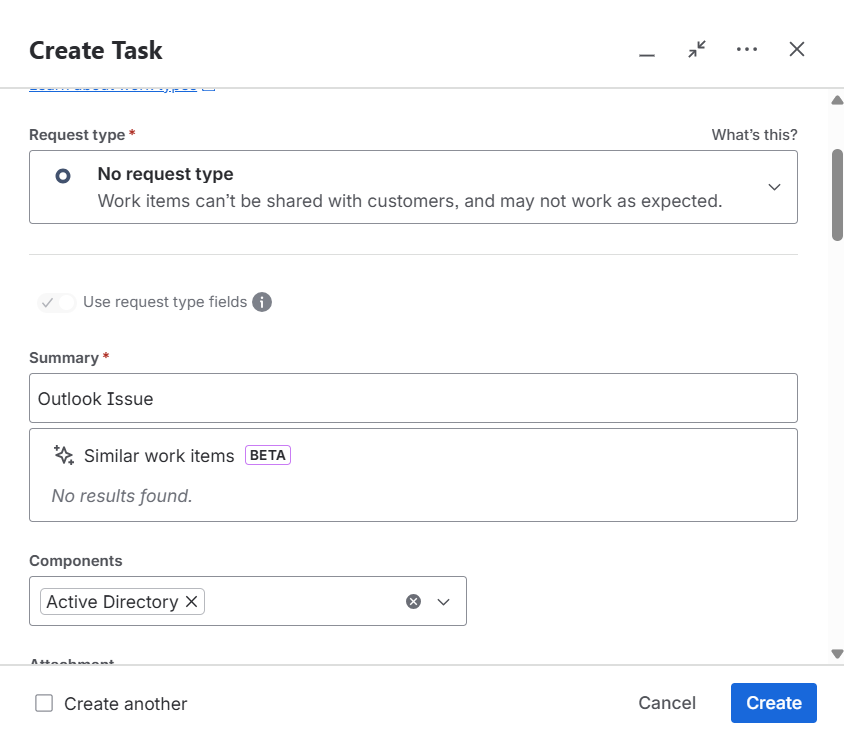
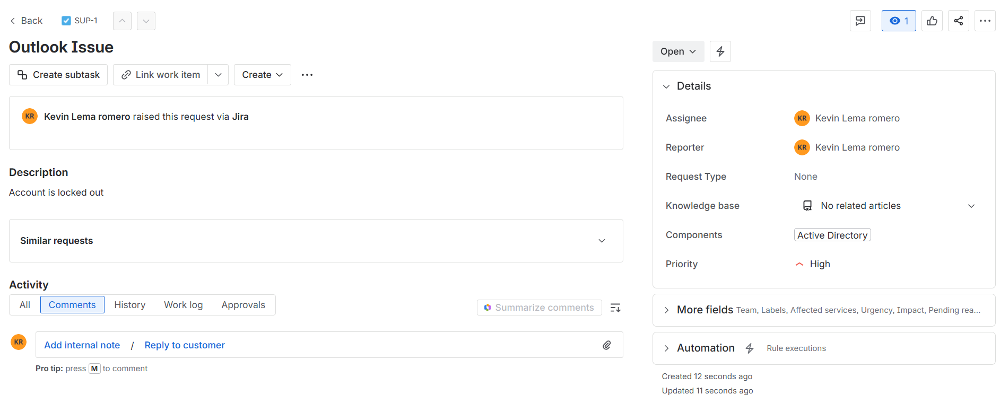
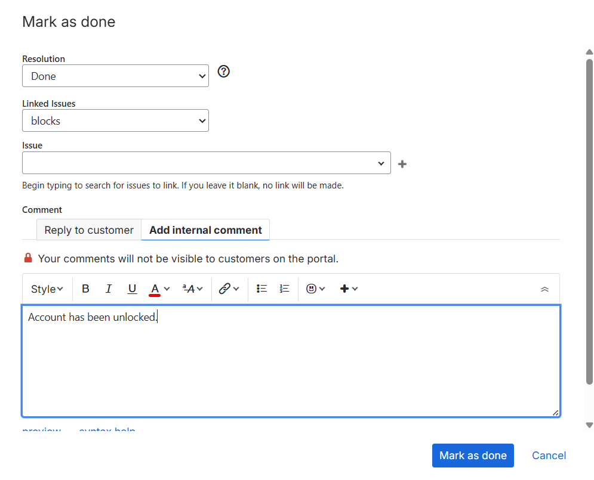
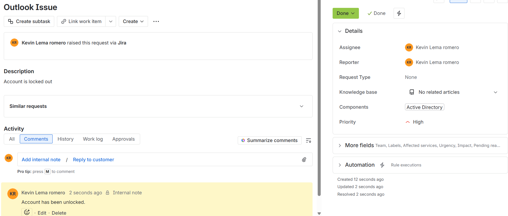

# Understanding Tickets Using Jira

## Understanding Tickets Using Jira
Tickets - is just a record of a problem or request made by a user.
It’s how helpdesk teams track and manage each issue from start to finish.

Jira - A free IT management tool used by helpdesk technicians and system administrators. It helps you track IT issues, manage devices, and communicate with users — all in one place.

Ticket System Levels - also called support tiers or helpdesk levels, define how IT support is organized based on complexity of issues and skills required to fix them. Each level handles different types of problems, from simple password resets to advanced network troubleshooting.

### Launching Jira on your Host Computer (On the Cloud)

1. Navigate to a web browser, go to Jira website, create a free account and log in

2. Once your on the homepage, navigate to the "Spaces" Panel and Create a new Space in order to manage your projects.

3. Navigate to your space all tickets should be in the Queues section.

### How to Create/Close a ticket

1. To create a ticket do the following,

- Click on "Create" on the top panel

- fill in Summary, Components, Description, Assignee, Priority and create ticket.

- The newly created ticket should look similar to this.

2. To close a ticket when completed do the following

- select "Open" on top right of ticket

- select "Mark as Done", fill in Resolution and apply proper notes to the client of the progress of the ticket.

- The closed ticket should look similar to this.

