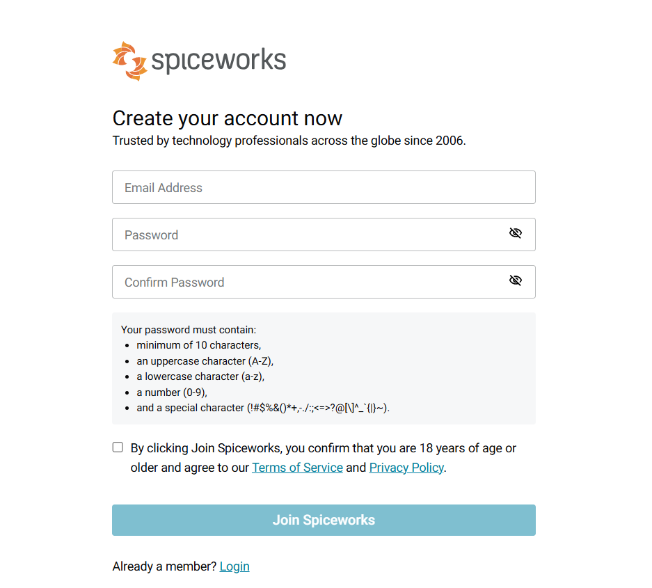
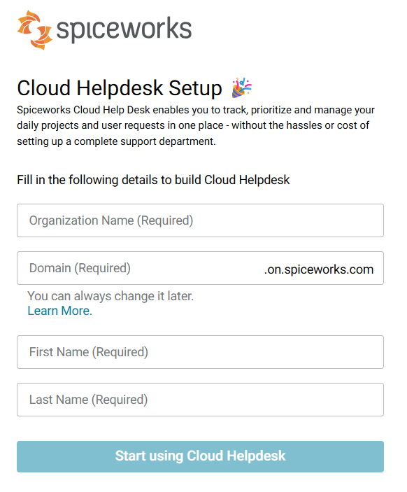
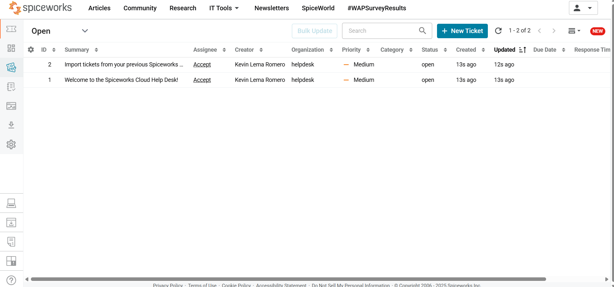
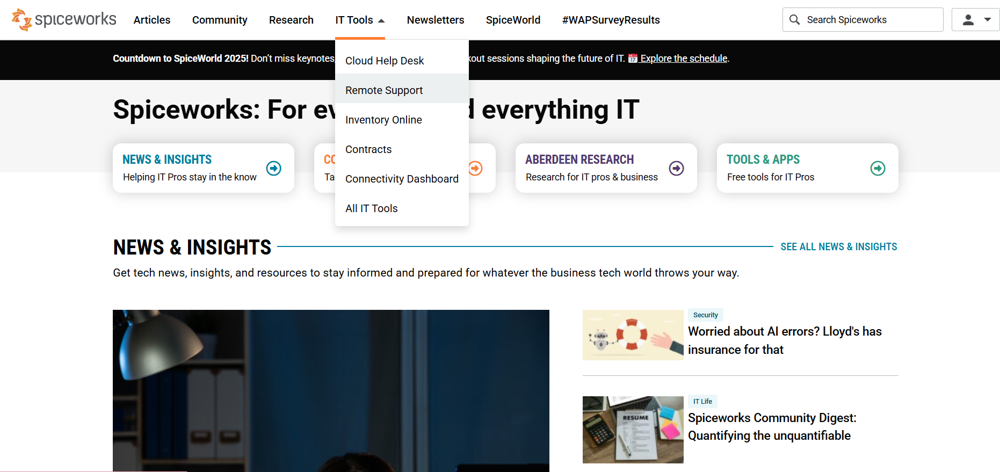
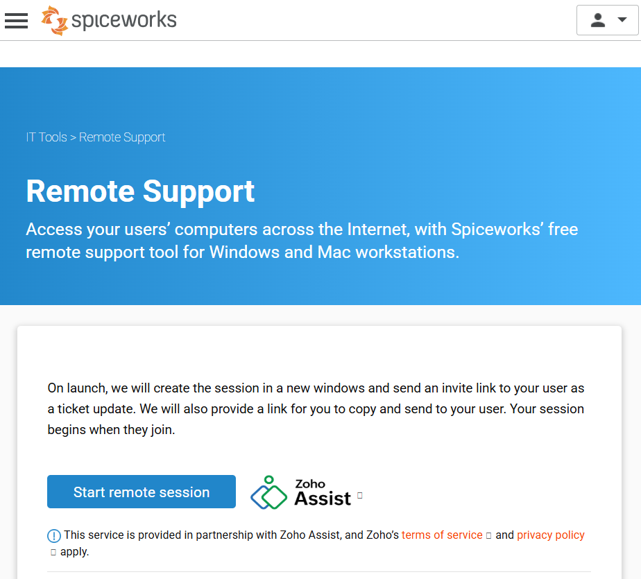
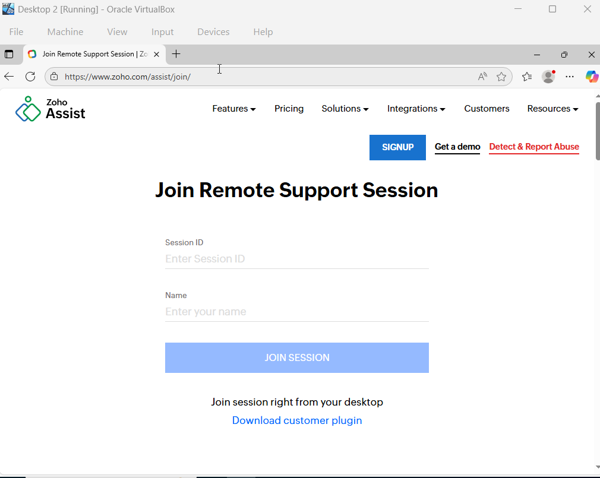

# Understanding Tickets Using Spiceworks

## Understanding Tickets Using Spiceworks
Tickets - is just a record of a problem or request made by a user.
It’s how helpdesk teams track and manage each issue from start to finish.

Spiceworks - A free IT management tool used by helpdesk technicians and system administrators. It helps you track IT issues, manage devices, and communicate with users — all in one place.

Ticket System Levels - also called support tiers or helpdesk levels, define how IT support is organized based on complexity of issues and skills required to fix them. Each level handles different types of problems, from simple password resets to advanced network troubleshooting.

### Launching Spiceworks on your Host Computer (On the Cloud)

1. Navigate to a web browser, go to Spiceworks website and create a free account and log in

2. Once your on the homepage, navigate to "IT Tools" -> select "Cloud Help Desk"

3. select "Try Cloud Help Desk" and setup a Cloud Help Desk

4. Spiceworks Ticketing System should look similar to the following:

### How to Remote on Spiceworks using Zoho (From Host to Desktop 2)

1. On your Host computer: 
- Navigate to "IT Tools" -> Remote Support

- select "Start remote session" and save session ID given

2. On Desktop 2 VM: 
- Navigate to a web browser -> search "join.zoho.com" -> Enter Host's session ID and a name -> Join a session

3. Host Computer should be able to Remote into the users Desktop via Spiceworks directly on the website.

