# Microsoft 365 Installation and Basics

Note:

- Microsoft 365 - platform that combines familiar productivity apps like Word, Excel, and PowerPoint with advanced cloud services, security, and device management.

## Installing Microsoft 365(Outlook and Word)

Note:

- We will be using a tool called the Office Deployment Tool (ODT), which lets you install only the specific apps you want. The ODT allows you to deploy specific Office applications only — for instance, Word, Excel, or Outlook — selectively.

1. Create a Microsft 365 Business Premium account (On host system):

- For this setup a free Trial for Microsoft 365 Business Premium must purchased or a subscription 

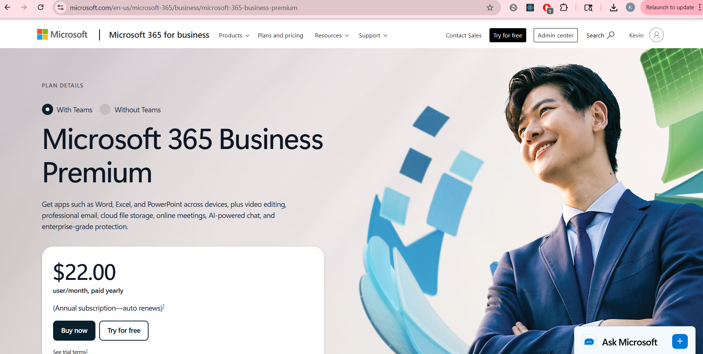

2. Assign a M365 License to a User (On host system):

Before installing anything on your VMs, make sure your Microsoft 365 Business Premium license is assigned to the user accounts that will be logging into those VMs.

- Go to admin.microsoft.com

- Click Users → Active users

- Select a user, then click Licenses and apps

- Check the box for Microsoft 365 Business Premium and click Save changes

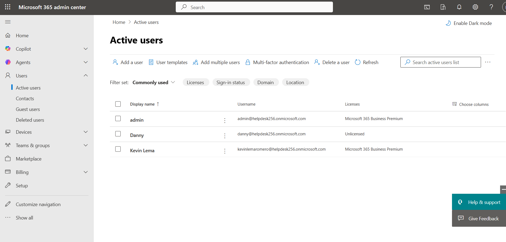

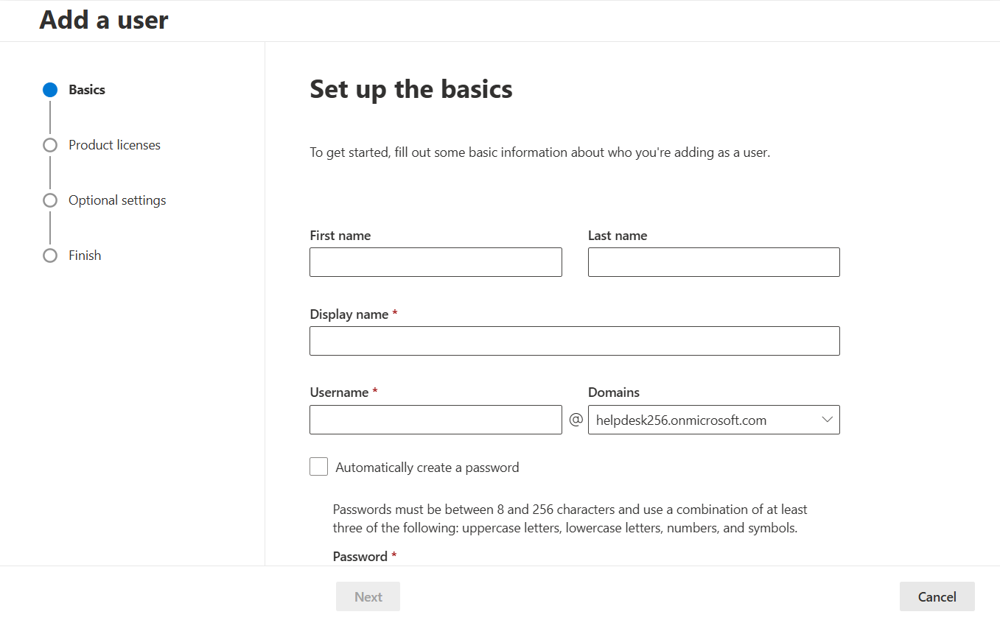

- Repeat for each user account tied to your VMs

3. Download the Office Deployment Tool(ODT) (On VM): 

- Inside your VM, open a web browser and go to:
https://www.microsoft.com/en-us/download/details.aspx?id=49117

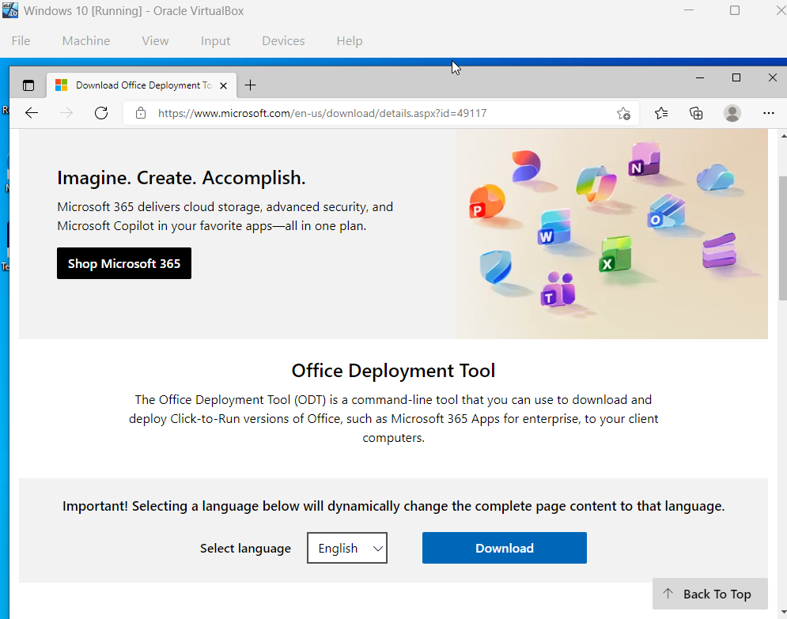

- Click Download

- Run the downloaded file — it will ask where to extract. Create and choose a folder like: "C:\ODT"

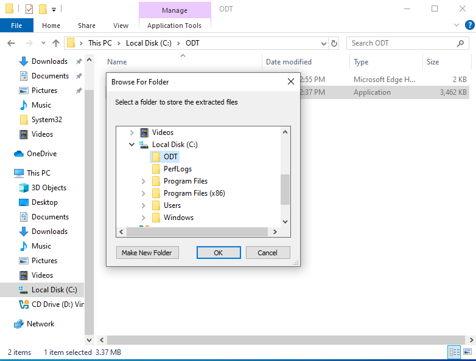

- Click OK to extract. You'll now have setup.exe and some sample XML files inside C:\ODT

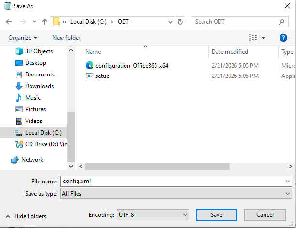

4. Create Custom Configuration File(XML) (On VM):

This is the key step for saving space — you'll tell the ODT exactly which apps to install and which to skip.

- Open Notepad (search for it in the Start menu)

- Paste the following XML — this installs only Outlook and Word (Everything in between "Configuration" tags)

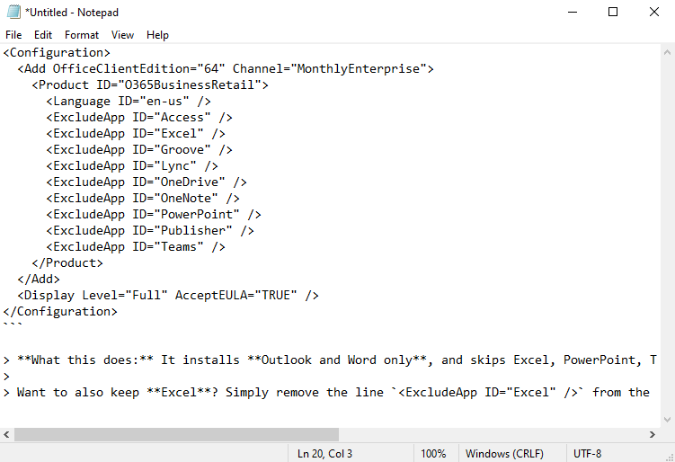

- Click File → Save As, Navigate to "C:\ODT"

- In the "Save as type" dropdown, choose "All Files", Name the file: "config.xml", and click Save

5. Run the Installation via Command Prompt(CMD) (On VM):

- Click the Start menu, type "cmd", then right-click Command Prompt and select "Run as administrator"

- Type the following command to navigate to your ODT folder: 
"cd C:\ODT"

- Press Enter, Now run the installer with your config file: "setup.exe /configure config.xml"

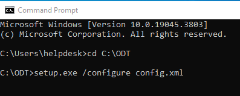

- Press Enter — the installation will begin. After running the command, you should see the Office installation start. After installation is complete, the command prompt will display "Products configured successfully."

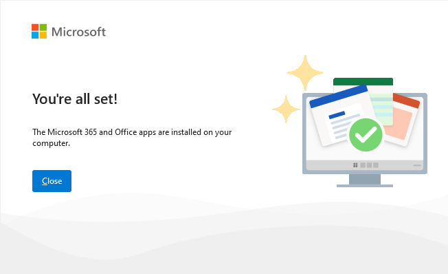

6. Sign-In to Activate (On VM):

- Open Outlook or Word from the Start menu

- You'll be prompted to sign in — use the Microsoft 365 account you assigned the license to

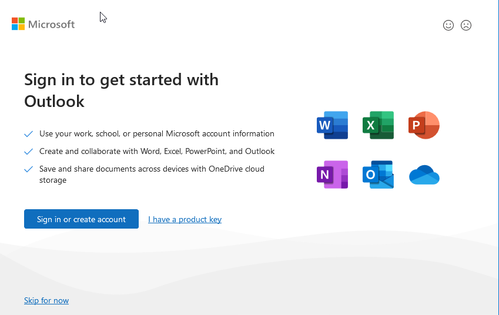

- Follow the prompts to complete activation

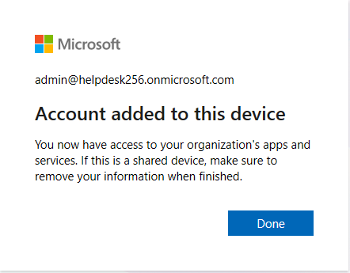

7. Repeat these steps on each of your virtual machines. Since each VM signs in with a different licensed user account, each one will activate independently.

