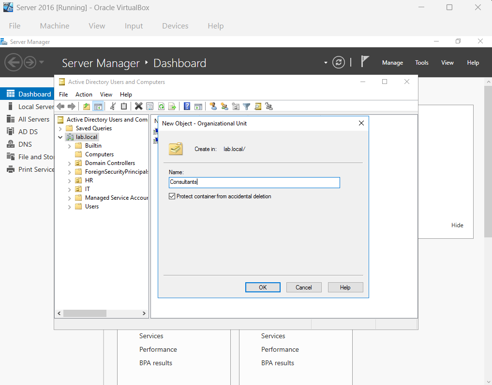

# Understanding Delegate Control and Account Lockout

## Delegation Control in Active Directory
Delegation Control - in Active Directory (AD) means giving specific users or groups limited administrative permissions — so they can manage certain tasks without giving them full admin rights.

### Delegation Control Example: Reset Passwords
Scenario - A Consultant group needs to be made and given specific permission to be able to reset a users password

1. To Create a "Consultants" group: 
- navigate to Active Directory Users and Computers and create a new organization Unit (OU) called "Consultants.

2. To Create a User (Ex: Scott) with "Consultant" permissions
- navigate to Active Directory Users and Computers, create a new User named "Scott", and move the user into the "Consultants" Group

3. To grant Delegation Control:
- Navigate to Active Directory Users and Computers -> right-click Domain(Ex: local.lab) -> Delegate Control
 

- In Delegation Control Wizard, add User to grant control to(Ex: Scott) and select which permissions to grant

4. To confirm Delegation Control is successful, log in as User (Ex: Scott) and try resetting another users password.

## Account Lockout

Account Lockout - Security feature that locks a user after too many failed logins.

Account Lockout Tool - Admin tool to check lockout status, see details, and unlock the account.

### Account Lockout Tool Installation

1. On your host computer, navigate to a web browser, download, and place the Account Lockout Tool in the shared folder created to share with your Server VM (Ex: "helpdesk Lab" folder)

2. On Server 2016 VM:
- Open Shared Folder

- Install Account Lockout Tool and place in desired location
 

3. Account Lockout Tool shows 
- Which domain controller locked the account.

- When the last bad password attempt happened.

- The lockout time.

- Whether the account is still locked.

