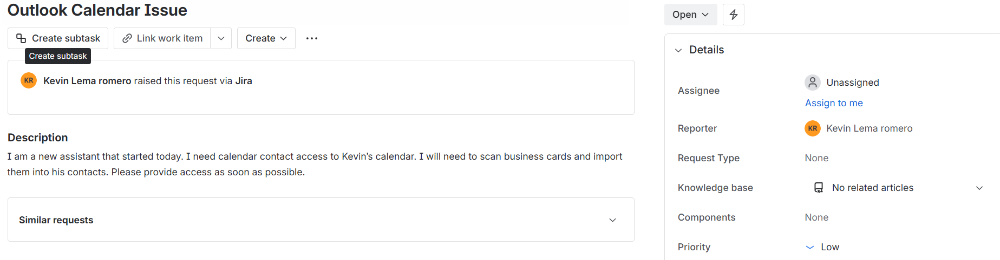
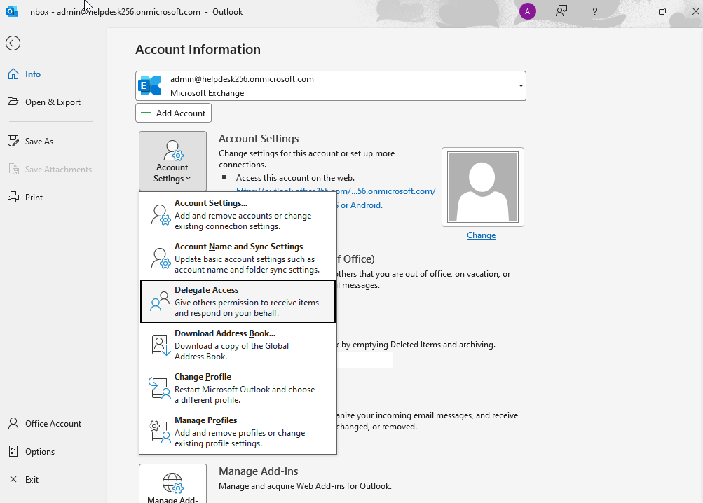
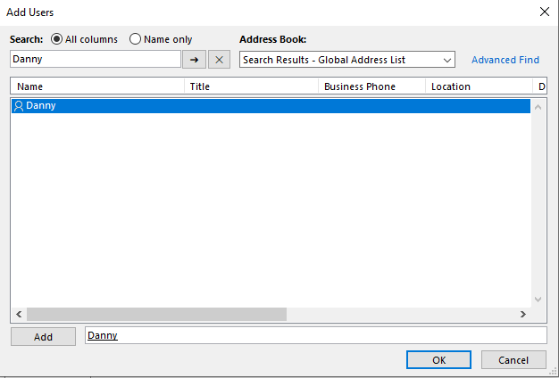
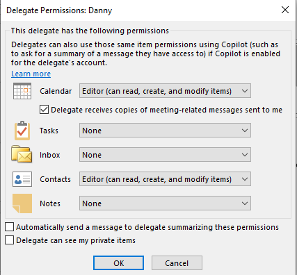

# Ticket 001 – Calendar Access

Department:Human Resources

Priority: Low

Issue Type: Calendar Outlook Access

## Ticket Description

## Steps Performed 

1. Before giving someone access you must first get appoval, in this case we got Kevin's approval to give the new assistant access to his calendar prior by email.

2. Open Outlook, navigate to File(top left) -> Info -> Delegate Settings 

3. In Account Settings, select "Add" -> Search new Assistent and click "OK"

4. In Delegate Permissions, give Calendar and Contacts Editor access to the new assistent 

