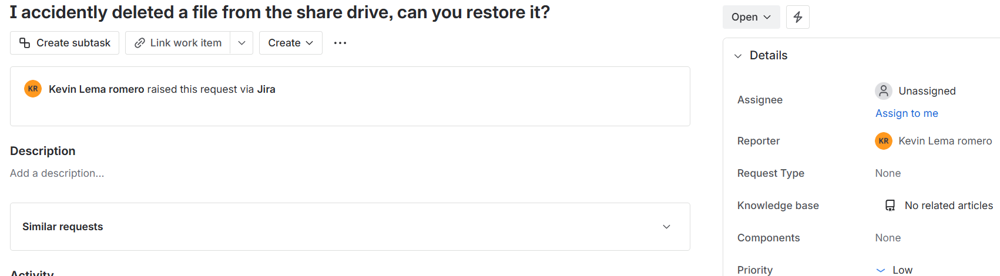
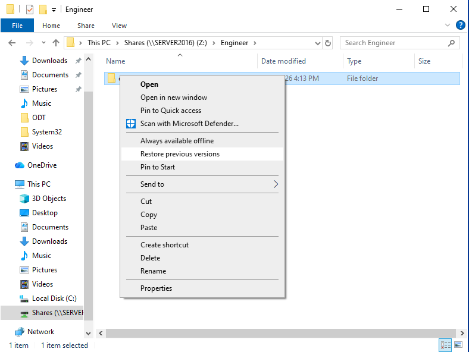
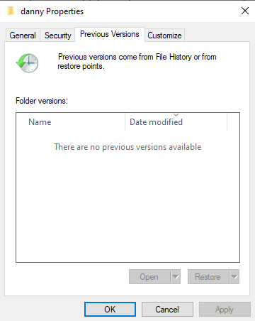

# Ticket 002 – File Restore

Department: Engineer
Priority: Low
Issue Type: Microsoft Word File Restore

## Ticket Description

## Steps Performed 

1. Open File Explorer, navigate to the shared folder associated with the user.

2. Right-click on the User Folder and select "Restore Previous Versions"

3. In the User's properties, select any files you want to restore, select apply and OK.

