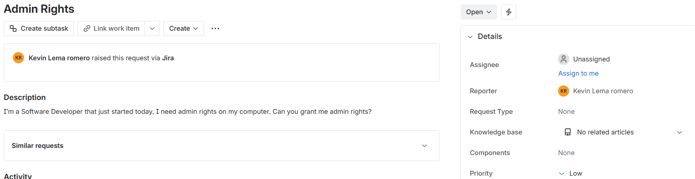
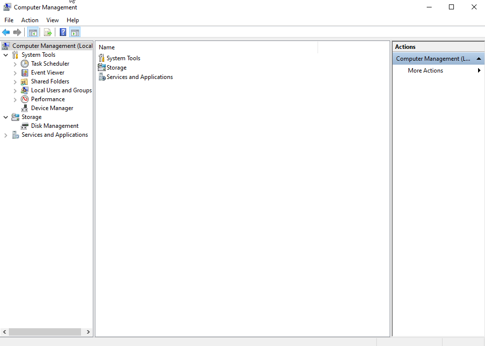
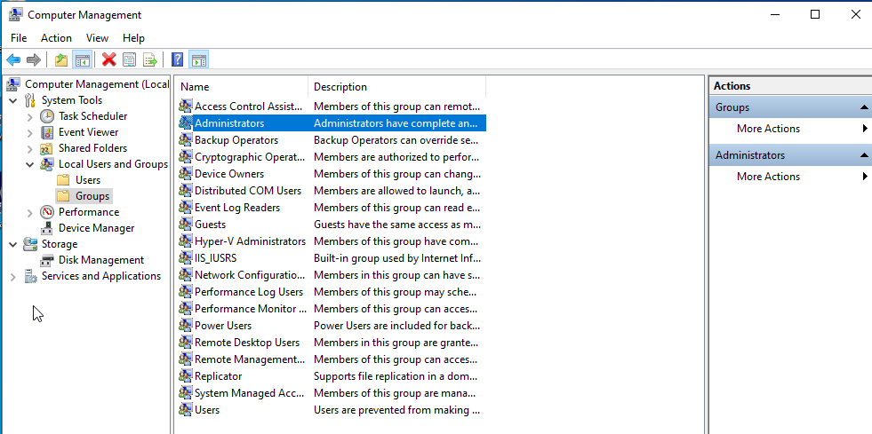
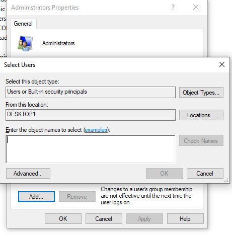
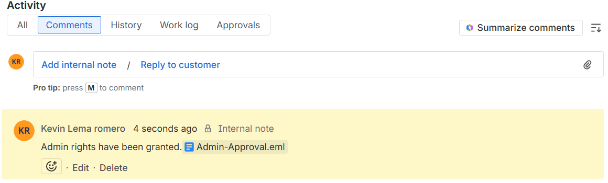

# Ticket 003 – Admin Rights 

Department: Software Developer
Priority: Low
Issue Type: Admin Rights on Local PC (Computer Management)

## Ticket Description

## Steps Performed

1. Before giving someone admin rights you must first get appoval, in this case we got approval to give this software developer admin rights before going any further with this ticket.

2. Open "Computer Management" on the Taskbar

3. In Computer Management, navigate to "System Tools" -> Local Users and Groups -> Groups -> select "Administrators"

4. In Administrators Properties, in order to give this user Admin rights you must search the User and add them to this group.

5. Before closing this ticket, you must attach a note to the user showing that you were given permission to do this action, in this case I attached an email that shows the approval.

