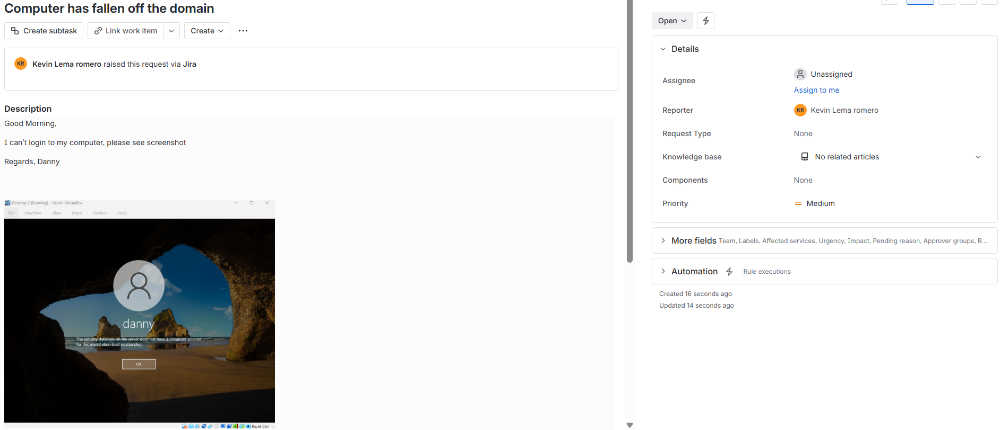
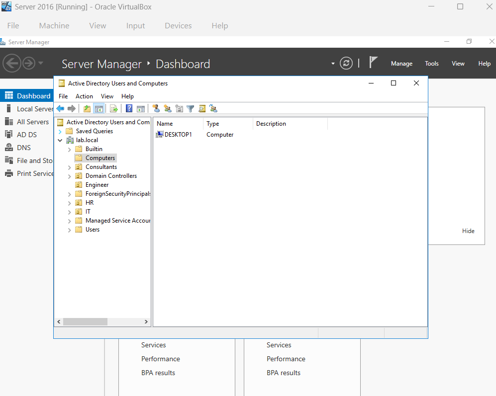
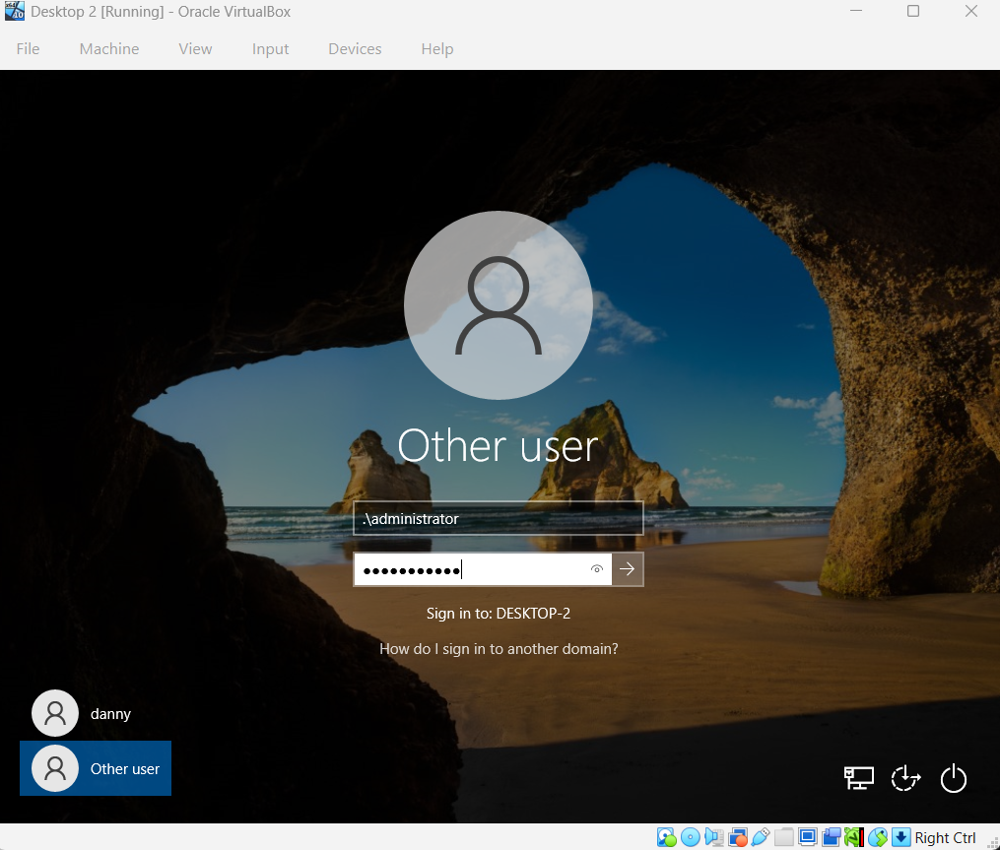
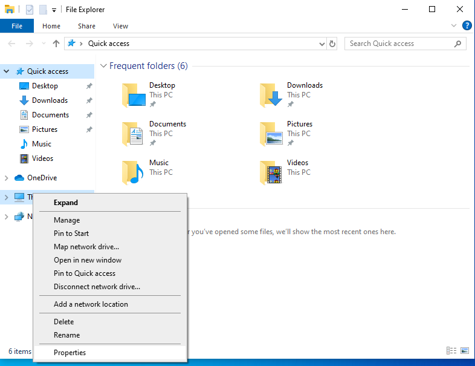
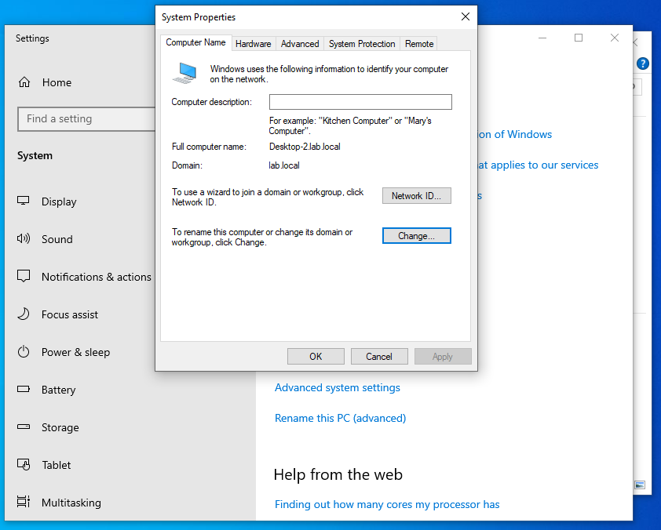
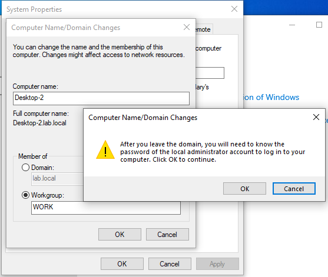
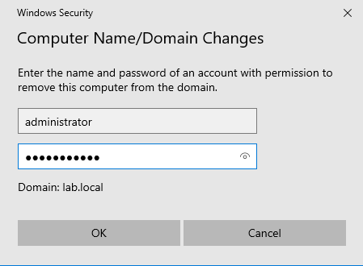
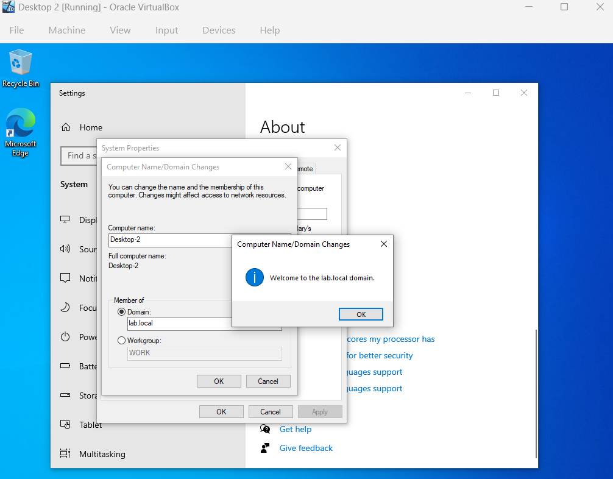

# Ticket 003 – PC Domain Trust Issue

Department: Engineer

Priority: High

Issue Type: PC having a Domain Trust Issue.

## Ticket Description

## Steps Performed

1. I need to verify if the PC is no longer in the system by checking the Windows Server and navigating into "Active Direcory Users and Computers" in order to see if the PC(Desktop-2) is there.

2. Login as local admin on the local pc of the user

3. Open File Explore then Right Click "This PC" and Hit Properties

4. Navigate to Advanced system setting -> "Computer Name" tab -> select Change

5. Select Workgroup then type anyname you like, click Okay 

6. Enter the admin credential of the Domain Controller, select restart

7. Repeat Steps 1 to 9 but this time at step 6 choose Domain and enter the correct domain name. AFter restarting the system the user should be back in the system and should be able to log in!!!

