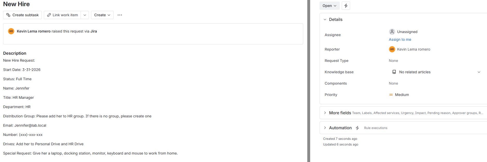
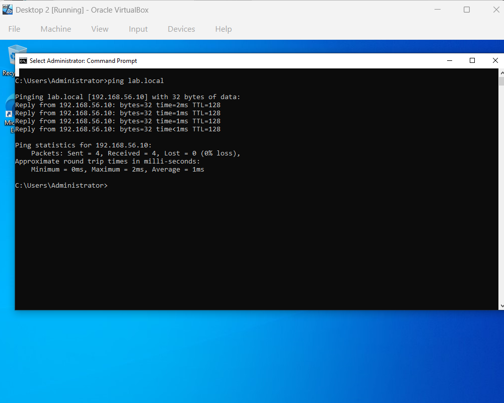
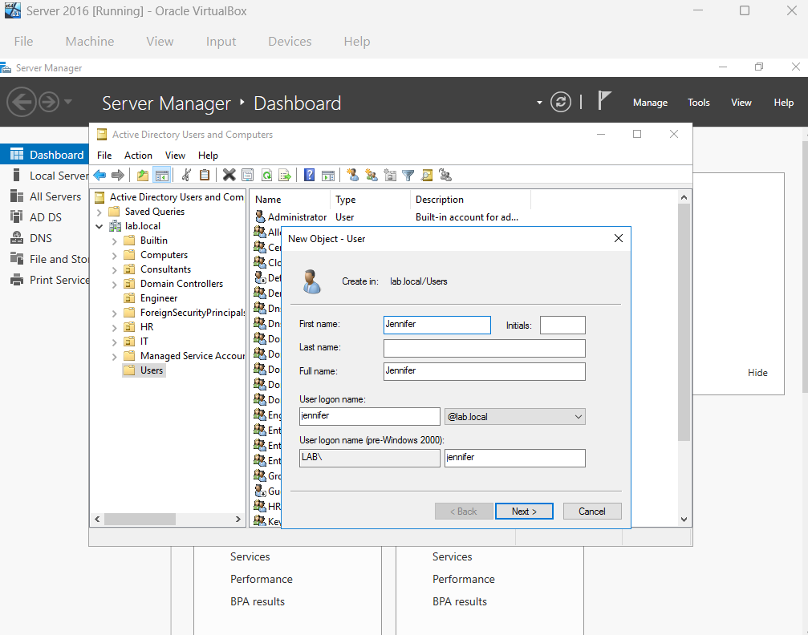
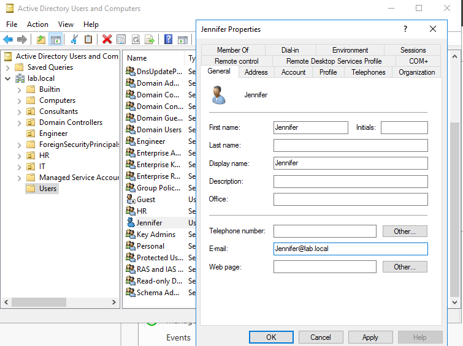
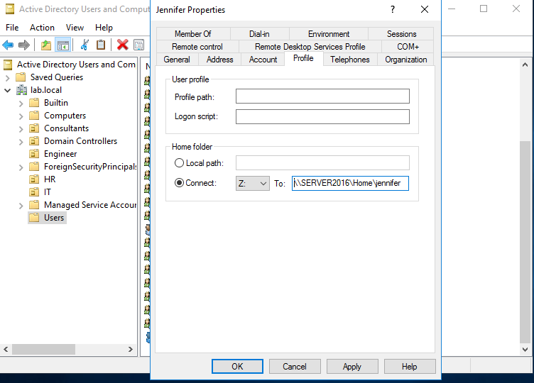
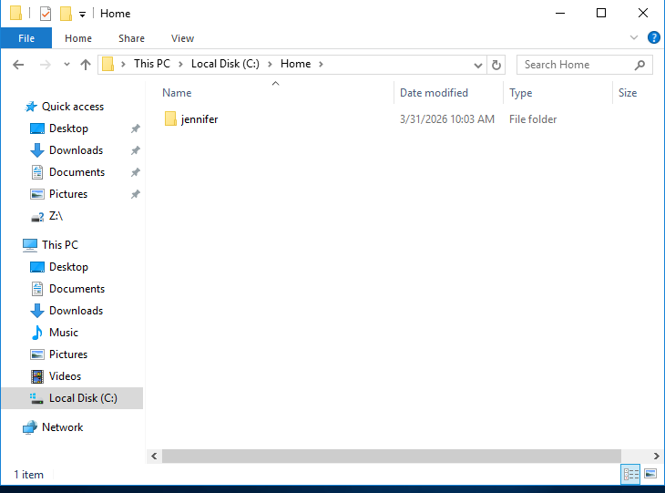
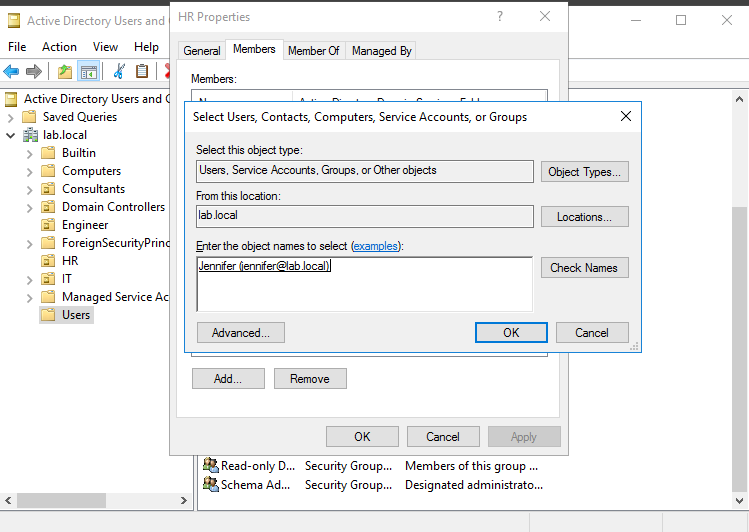
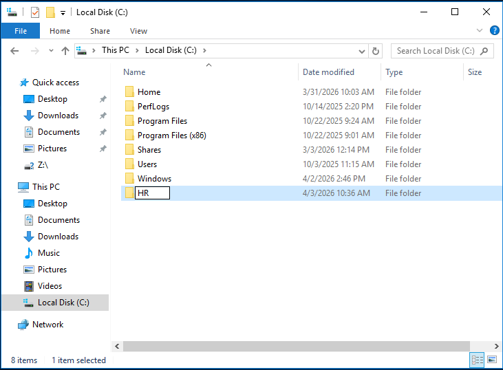
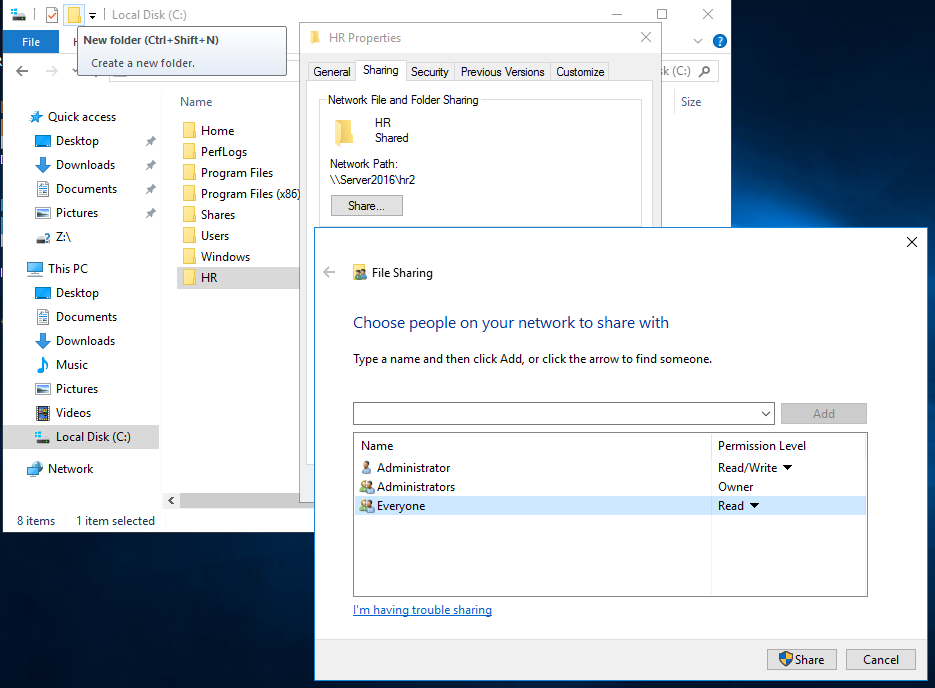

# Ticket 005 – New Hire 

Department: Human Resources

Priority: Low

Issue Type: Setup the PC for a New Hire employee

## Ticket Description

## Troubleshooting Steps Performed

1. In User PC, Check if the computer is ready to be added to the domain by pinging the domain name CMD(Command Line Prompt).

2. Join the workstation to the domain (you can see how to do this from ticket 004: Domain Trust Issue)

3. In the Server, Create an account of the user in Active Directory Users and Computers and add desired info

3. Add a home folder drive for the user in the server and map a new drive to that folder

5. To verify the user is mapped to the home folder check the Server's C: drive home folder

4. Add the user to a specific distribution group as member in Active Directory(in this case it would be adding Jennifer to the HR distribution group)

5. Create a Folder for department on local disk and Map the network drive of the user to their designated department

6. Create a mailbox of the user

7. login to the user's laptop using the newly created account

8. Create an app shortcuts & other stuff to make it look in a professional setup

9. Possible Job interview question: How do you mapped a drive on the local pc